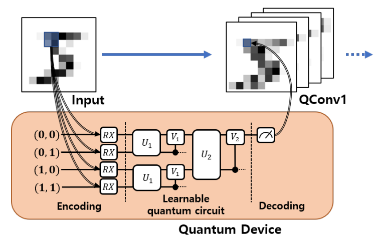

# Lightning talk of the night

---
revealOptions:
  transition: 'fade'
  transitionSpeed: 'fast'
  width: 1400
---
<style>
.container{
    display: flex;
}
.col{
    flex: 1;
}
.small-font{
    font-size:20px;
}
</style>

## Quantum Convolutional Neural Networks for High Energy Physics Analysis at the LHC

<div>

</div>

<div class="container">

<div class="col">
<a href = 'https://www.linkedin.com/in/gopal-ramesh-dahale-7a3087198/'>Gopal Ramesh Dahale</a>
</div>
<div class="col">
Mentor: Prof. <a href ='http://sergeigleyzer.com/'> Sergei V. Gleyzer </a>
</div>
</div>

[Github repository](https://github.com/Gopal-Dahale/qml-hep-lhc)

---

## Datasets


<div class="container">

<div class="col">

</div>

<div class="col">
<div><b>Electron Photon</b></div>
<div>&nbsp;</div>
<ul>
<li>32 $\times$ 32 image size.</li>
<li>Total of 498k images</li>
<li>Preprocessing likes center crop (8,8), PCA, standard and logarithmic scaling.</li>
</ul> 
</div>

</div>

The image shows the energy and time channels for electrons (top) and photons (bottom).
For training only energy channel is used.

---
## Preprocessing map


---

<div class="container">

<div class="col">
<div><b>Quark Gluon</b></div>
<div>&nbsp;</div>
<ul>
<li>125 $\times$ 125 image size.</li>
<li>Total of 700k images</li>
<li>Preprocessing likes center crop (40,40), PCA, standard and logarithmic scaling.</li>
</ul> 
</div>

<div class="col">

</div>
</div>

The image shows the ECAL, HCAL and time channels for Quarks (top) and Gluons (bottom).
For training only ECAL channel is used.

---

## Hybrid QCNN Architectures


```
──H──RZ(M0)──RY(M1)──RZ(M2)──RZ(M3)──RY(M4)──RZ(M5)──RZ(M6)──RY(M7)──RZ(M8)─┤<Z>
```
Illustrations have a kernel size of (3,3). Circuits are followed by classical fully connected layers.

---

## Results on Electron Photon

<p class='small-font null'> 90k train, 20k test samples, Arch1 (left), Arch2 (right)</b></p>


Best Test AUC:
- QCNN: 0.756
- CCNN: 0.76

---

## Results on Quark Gluon

<p class='small-font null'> 90k train, 20k test samples, Arch1 </b></p>


Best Test AUC:
- QCNN: 0.64

Models tend ot Overfit.

---


<p class='small-font null'><b> Trained on Full dataset</b></p>

<p class='small-font null'> (Arch2) EP | 1 qubit | 2 layers | Train AUC: <b>0.77</b>  |  Test AUC: <b>0.7684</b></p>


<p class='small-font null'> (Arch2) QG | 1 qubit | 1 layer | Train AUC: <b>0.723</b>  |  Test AUC: <b>0.699</b></p>


---

## Discussion

- Quantum models perform at par with classical models with same number of parameters.
- Increasing the qubits or layers does not necessarily increases the AUC. Had to tune these hyperparameters.
 
---

## Future work

- Classical vision transformers seems promising. Implementing the quantum version might give some advantage.
- Using gradient free optimization techniques to train quantum neural network.

---

## References

- Cong, I., Choi, S. & Lukin, M.D. Quantum convolutional neural networks. Nat. Phys. 15, 1273–1278 (2019). https://doi.org/10.1038/s41567-019-0648-8
- S.~Y.~C.~Chen, T.~C.~Wei, C.~Zhang, H.~Yu and S.~Yoo, ``Quantum convolutional neural networks for high energy physics data analysis,'' Phys. Rev. Res. \textbf{4} (2022) no.1, 013231 doi:10.1103/PhysRevResearch.4.013231
- Liu, J., Lim, K.H., Wood, K.L. et al. Hybrid quantum-classical convolutional neural networks. Sci. China Phys. Mech. Astron. 64, 290311 (2021). https://doi.org/10.1007/s11433-021-1734-3
- Tüysüz, C., Rieger, C., Novotny, K. et al. Hybrid quantum classical graph neural networks for particle track reconstruction. Quantum Mach. Intell. 3, 29 (2021). https://doi.org/10.1007/s42484-021-00055-9
- Pérez-Salinas, A., Cervera-Lierta, A., Gil-Fuster, E., & Latorre, J. (2020). Data re-uploading for a universal quantum classifier. Quantum, 4, 226.
- Chen, Yusui & Hu, Wenhao & Li, Xiang. (2021). Feasible Architecture for Quantum Fully Convolutional Networks.
- Chen, Yixiong. (2021). QDCNN: Quantum Dilated Convolutional Neural Network.
