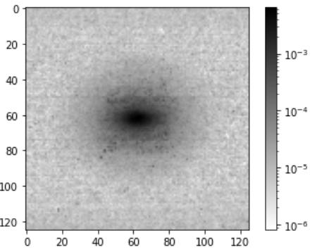
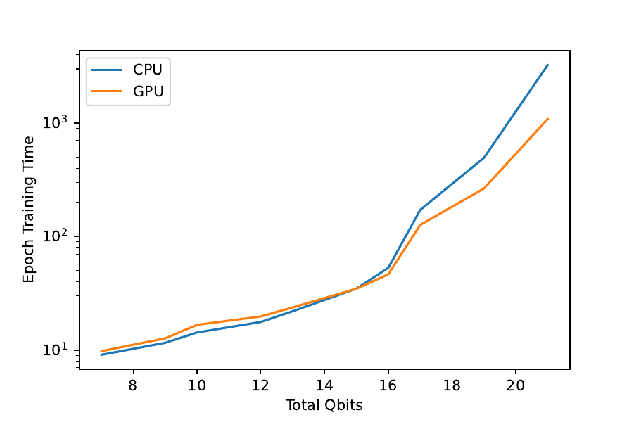
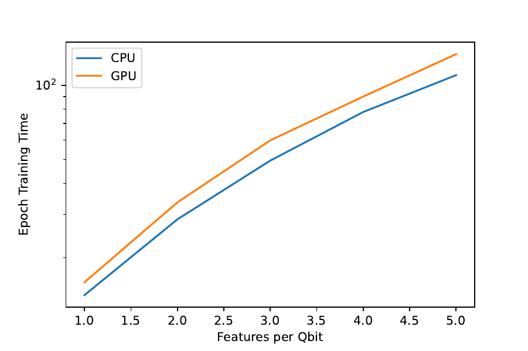
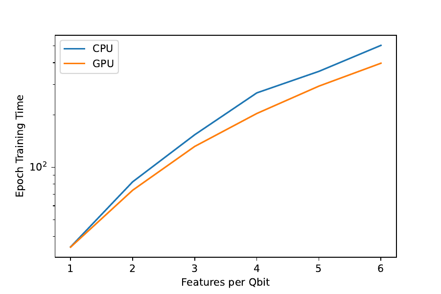
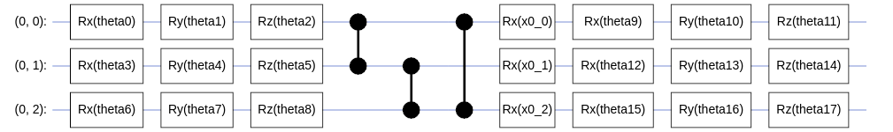

# Absolute Power with GPUs

### DETECTOR IMAGES FOR PARTICLE TAGGING AND JET SUBSTRUCTURE

### PHENOMENOLOGY

Photon

Quark Jet

## CUQUANTUM BENCHMARK ON QUANTUM AUTOENCODER

- Training with lightning.gpu in pennylane, one feature per qubit
- Samples: 800
- Batch size: 20

## MNIST BENCHMARK

- Training on QSimCirq + CuQuantum
- Samples: 2000
- DRC circuit

# BACKUP

## FEATURES PER QUBIT

## QAE

Latent space = Data // 2

## DRC

