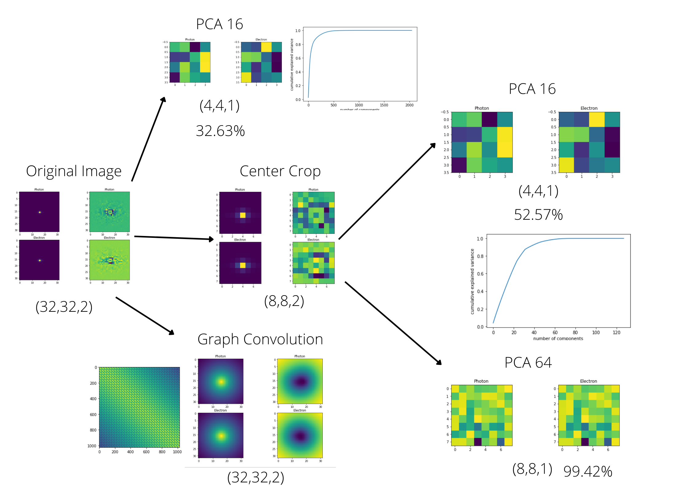
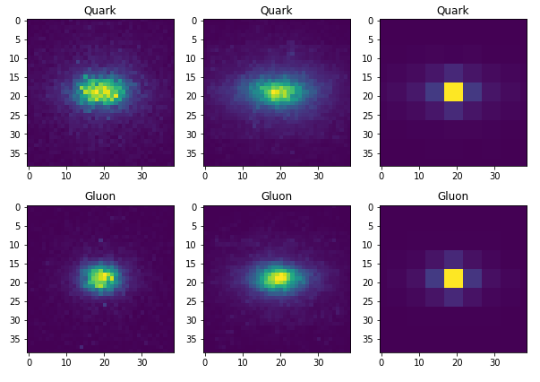

# Fame of the Convolution

---
revealOptions:
  transition: 'fade'
  transitionSpeed: 'fast'
  width: 1400
---

## Classical Models

- Resnet v1* and v2+ (both have slightly different architecture)
- Classical CNN (variable Conv and FC layers)
- FFNN (variable FC layers)

Last two will be used to for comparing results with Quantum models

- *[Deep Residual Learning for Image Recognition](https://arxiv.org/abs/1512.03385)
- +[Identity Mappings in Deep Residual Networks](https://arxiv.org/abs/1603.05027)

---

## Quantum outline

---

## Dataset sizes

| Dataset      | Train | Test |
| ----------- | ----------- | ----------- |
| MNIST      | 12665       | 2115      |
| ElectronPhoton*   | 9000        | 1000        |
| QuarkGluon*   | 9000        | 1000        |

 *Randomly sampled.

---

## Data preperation

- PCA
- Standardize
- Center Crop
- Graph Convolution
- Min max scaling (-pi, pi)

---

## Encoding Circuits

Angle Map   

(0, 0): ───Rx(pi*x0)───   
 
(0, 1): ───Rx(pi*x1)───   

(0, 2): ───Rx(pi*x2)───   

(0, 3): ───Rx(pi*x3)───   

Double Angle Map

 ───Ry(pi*atan(x0))───Rz(pi*atan(x1**2))───

 ───Ry(pi*atan(x2))───Rz(pi*atan(x3**2))───

 ───Ry(pi*atan(x4))───Rz(pi*atan(x5**2))───

 ───Ry(pi*atan(x6))───Rz(pi*atan(x7**2))───

---

## Encoding Circuits Contd.
Amplitude Map*

*[Supervised Learning with Quantum Computers](https://link.springer.com/book/10.1007/978-3-319-96424-9)
    
---

## Quantum model

Figure from [Quantum convolutional neural networks for high energy physics data analysis](https://arxiv.org/abs/2012.12177)

---

## Ansatzes

- Observable: $-0.5Z + 0.5 I$
- Loss Function: Binary cross entropy
- Implementation: tfq.layers.ControlledPQC 
- Data ReUploading or not? Pass an argument.
- More ansatzes comming soon.
- Single qubit classifier?

---

## Evaluation

Classical Models

- Performed Multi-GPU Hyperparameter Sweeps on Resnet v1 and v2 with MNIST, ElectronPhoton and QuarkGluon
- learning rates $\in$ 0.01, 0.001, 0.0003
- Resnet v1 depths $\in$ 20, 40, 110
- Resnet v1 depths $\in$ 20, 56, 110
- (3 $\times$ 3 ) $\implies$ 9 runs per model per dataset

---

## Results

MNIST Resnet V1

---

## Results Contd.

Electron Photon Resnet V1

---

## Results Contd.

Electron Photon Resnet V2

---

## Results Contd.

More visualizations on [here](https://wandb.ai/gopald/qml-hep-lhc?workspace=user-gopald)

---

## Quantum Status

- Created ansatzes for Chen et al. and Cong at el.
- Trained those for sampled dataset
- Facing some issues while training model on big dataset (posted on slack)
- Seeking a workaround for it.

---

## Status

 Done: 

- Data preprocessing
- Classical models training
- Encoding circuits
- Ansatzes (Chen et al. and Cong at el)
- Trained locally on small samples

 Goals for next week: 

- Fixing training bug
- Sandwich circuits between classical layers.
- Train ansatzes on larger dataset
- Try DRC
- Try single qubit classifier

 Questions: 

- Shall we try multi class classification? Do we need it in particle physics?
- Any help with the bug? 
- Any suggestion for papers?
- Any other feedback?

---

## References

- Cong, I., Choi, S. & Lukin, M.D. Quantum convolutional neural networks. Nat. Phys. 15, 1273–1278 (2019). https://doi.org/10.1038/s41567-019-0648-8
- S.~Y.~C.~Chen, T.~C.~Wei, C.~Zhang, H.~Yu and S.~Yoo, ``Quantum convolutional neural networks for high energy physics data analysis,'' Phys. Rev. Res. \textbf{4} (2022) no.1, 013231 doi:10.1103/PhysRevResearch.4.013231
- Liu, J., Lim, K.H., Wood, K.L. et al. Hybrid quantum-classical convolutional neural networks. Sci. China Phys. Mech. Astron. 64, 290311 (2021). https://doi.org/10.1007/s11433-021-1734-3
- Tüysüz, C., Rieger, C., Novotny, K. et al. Hybrid quantum classical graph neural networks for particle track reconstruction. Quantum Mach. Intell. 3, 29 (2021). https://doi.org/10.1007/s42484-021-00055-9
- Pérez-Salinas, A., Cervera-Lierta, A., Gil-Fuster, E., & Latorre, J. (2020). Data re-uploading for a universal quantum classifier. Quantum, 4, 226.
- Chen, Yusui & Hu, Wenhao & Li, Xiang. (2021). Feasible Architecture for Quantum Fully Convolutional Networks.
- Chen, Yixiong. (2021). QDCNN: Quantum Dilated Convolutional Neural Network.
