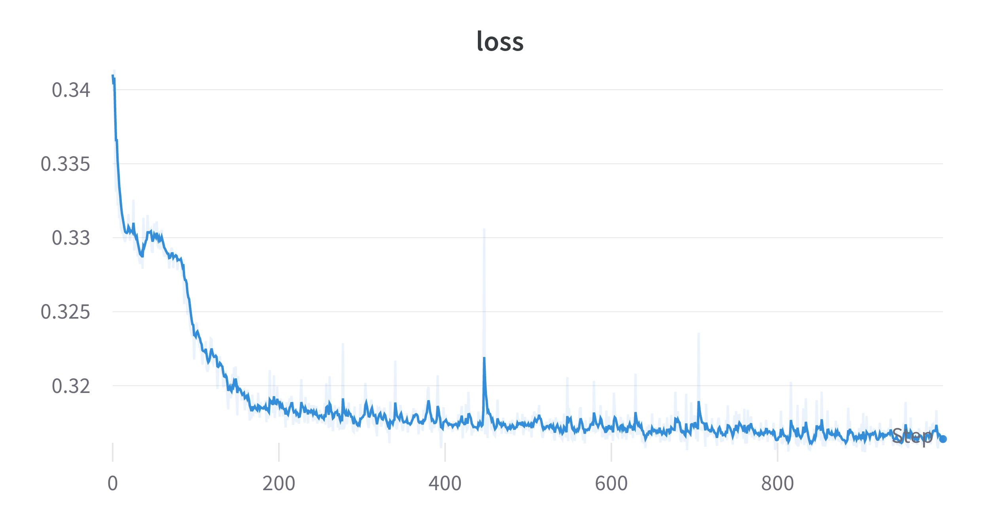
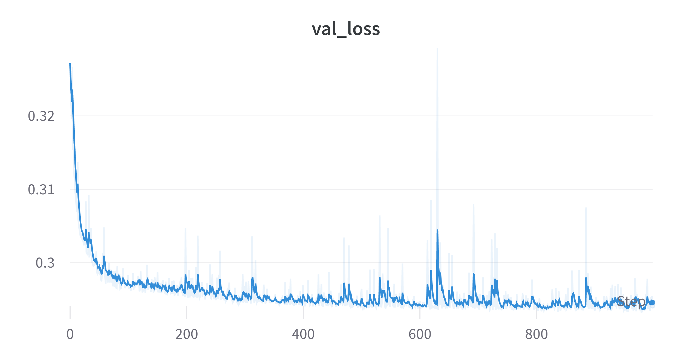
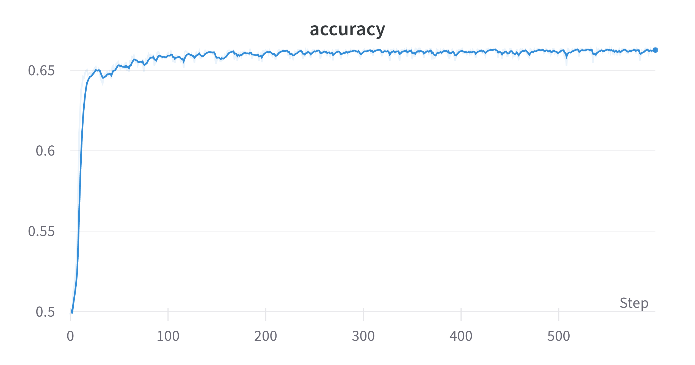

---
revealOptions:
  transition: 'fade'
  transitionSpeed: 'fast'
  width: 1400
---

#### Tuned some hyperparameters

- Cropped to 10 $\times$ 10 instead of 8 $\times$ 8 for the Electron-Photon dataset.
- Used batch size of 1024 over the full dataset.
- Tried data augmentation techniques like
    - Random flip
    - Random rotation

---

###### With Data augmentation

 1 qubit | 1 layer | Train AUC: <b>0.70</b>  |  Test AUC: <b>0.70</b>

 

---

###### Without Data augmentation

 1 qubit | 1 layer | Train AUC: <b>0.76</b>  |  Test AUC: <b>0.759</b>

 

---

###### More layers

 1 qubit | 2 layers | Train AUC: <b>0.77</b>  |  Test AUC: <b>0.7684</b>

 

---

- Increasing the number of qubits from 1 to 2 gives similar results.
- Try Cropping to 12 $\times$ 12 instead of 10 $\times$ 10.

---
###### With Data augmentation

 1 qubit | 1 layer | Train AUC: <b>0.68</b>  |  Test AUC: <b>0.68</b>

 

---

###### Without Data augmentation

 1 qubit | 1 layer | Train AUC: <b>0.767</b>  |  Test AUC: <b>0.767</b>

 

---

###### Result with full Quark Gluon (40 x 40)

 1 qubit | 1 layer | Train AUC: <b>0.723</b>  |  Test AUC: <b>0.699</b>

 

---

## Status

 Done: 

- Trained QCNNHybrid on EP with JAX + Pennylane and got some good results than past ones.
- Trained on QG but not very good results.
- Used data augmentation techniques but seems not promising for QCNN.

 Goals for next week: 

- Documentation and cleaning up stuff.
- Setting github repo properly.

