# Fused Transfer Learning with Quantum

---
revealOptions:
  transition: 'fade'
  transitionSpeed: 'fast'
  width: 1400
---
<style>
.container{
    display: flex;
}
.col{
    flex: 1;
}
.small-font{
    font-size:25px;
}
</style>

## Classical Models

ElectronPhoton Energy channel - ResnetV1 - Depths 20, 44 - 40 epochs

| Depth      | Acc | Val acc|
| ----- | ----- | ----- |
| 20    |0.8      | 0 .64     |
| 44   | 0.79       | 0.626       |

<div>
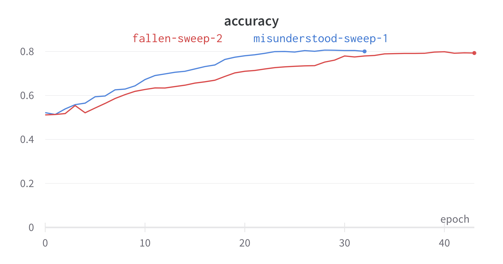
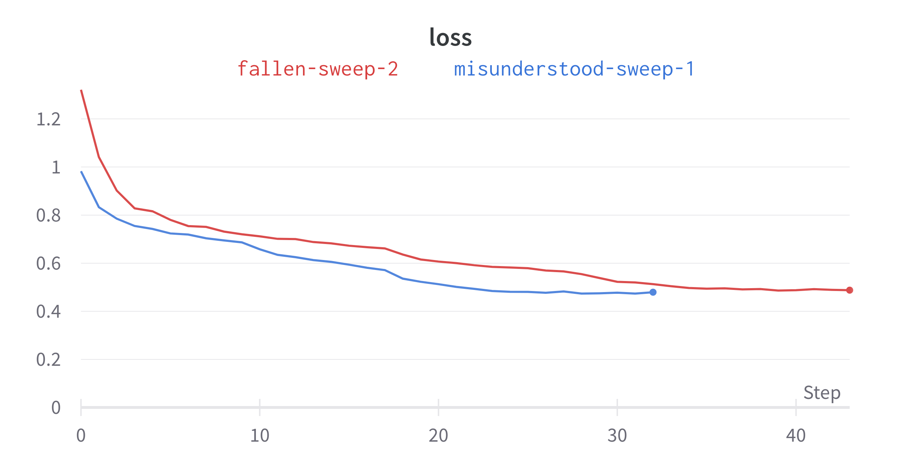
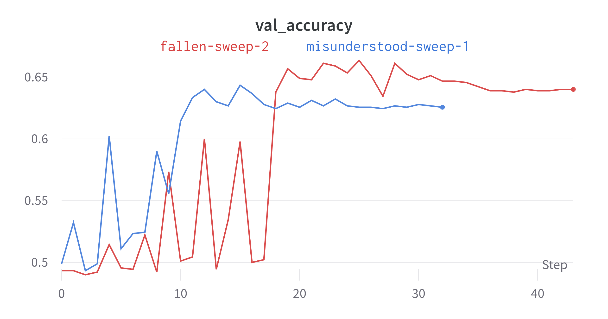
</div>

---

## Results on Pretrained model

- Resnet50 $\rightarrow$ 512 $\rightarrow$ 128 $\rightarrow$ 2
- Pretrained on ImageNet
- Using Log scaling with Ranger Optimizer
- Acc: 0.5, Val Acc: 0.5

<div>
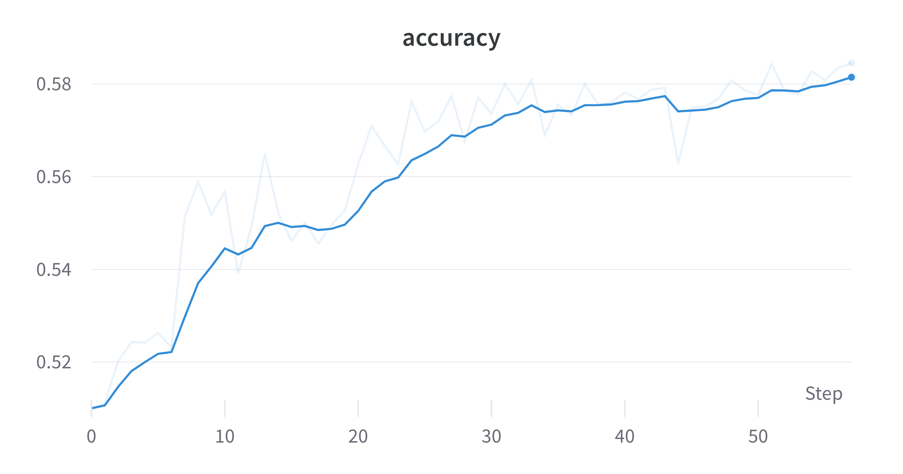
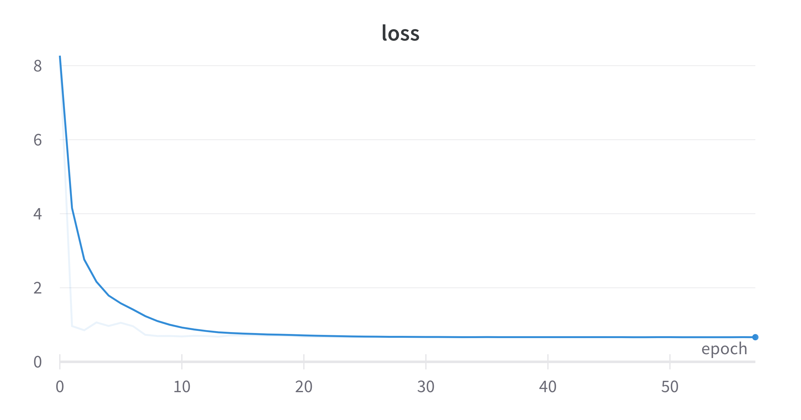
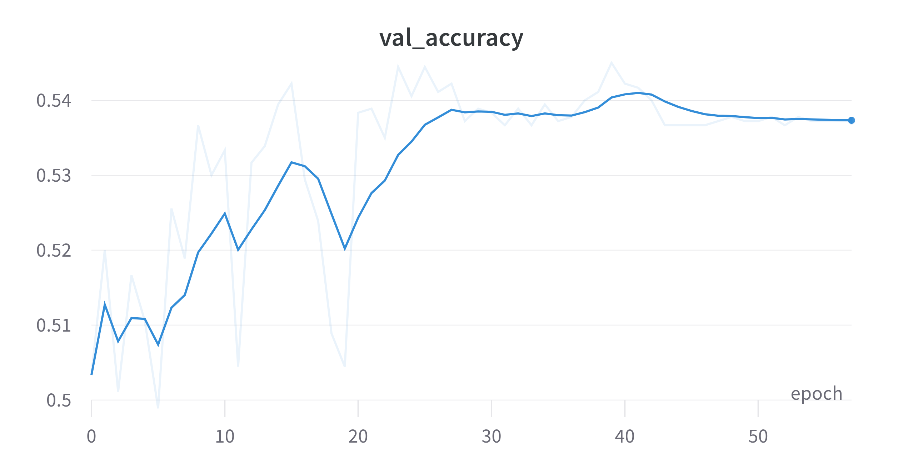
</div>
---

## Results on Quantum CNN

- Mini Mnist
    - 0 1 images
    - 200 images per class
    - Center cropped $\rightarrow$ (20,20)
    - Resized $\rightarrow$ (8,8)
- Sweep using Chen Ansatz (3 layers). Using DRC.
- Feature maps: Amplitude, Angle, Basis.
- 10 epochs

---

### Quantum CNN

```
Model: "QCNN-AmplitudeMap-Chen"
_________________________________________________________________
 Layer (type)                Output Shape              Param #
=================================================================
 input_1 (InputLayer)        [(None, 8, 8, 1)]         0
 qconv2d_1 (QConv2D)         (None, 4, 4, 1)           81
 flatten (Flatten)           (None, 16)                0
 TwoLayerPQC (TwoLayerPQC)   (None, 1)                 81
=================================================================
Total params: 162
Trainable params: 72
Non-trainable params: 90
_________________________________________________________________
```

<div class="container">

<div class="col">
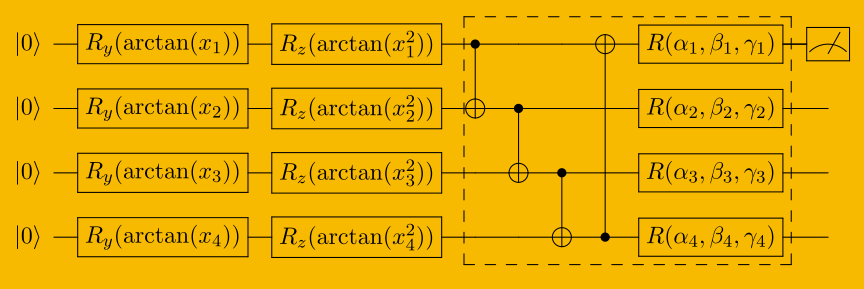
</div>

<div class="col">
<ul>
    <li>Kernel: (3,3)</li>
    <li>Strides: (2,2)</li>
    <li>Op: -0.5*Z + 0.5*I</li>

</ul>
</div>
</div>

---

### Results

| Feature Map      | Acc | Val acc|
| ----- | ----- | ----- |
| Amp    |0.9375      | 0 .933    |
| Angle  | 0.9896      | 0.9917       |
| Basis | 0.5    | 0.5       |

BasisMap without DRC gives the same scores.

<div>
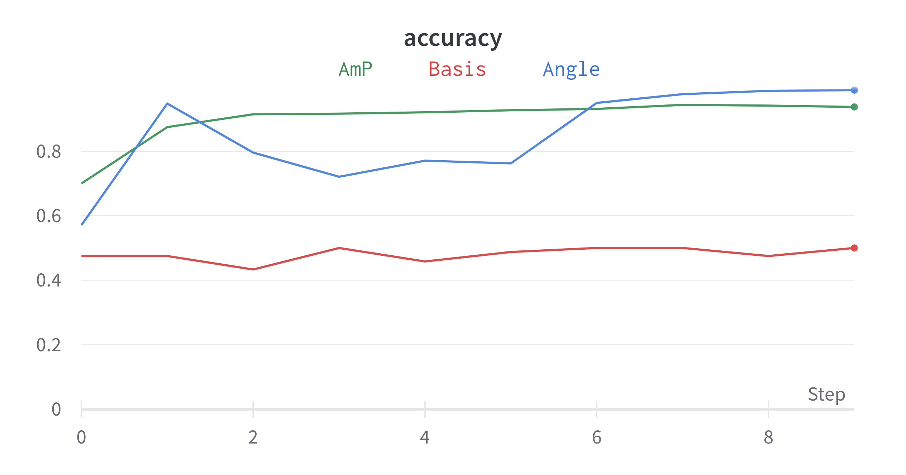
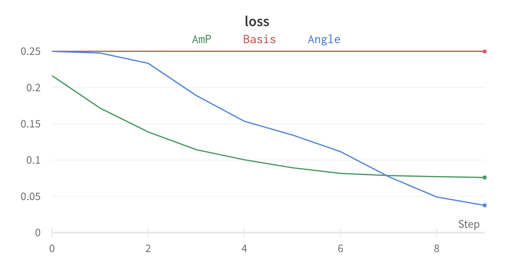
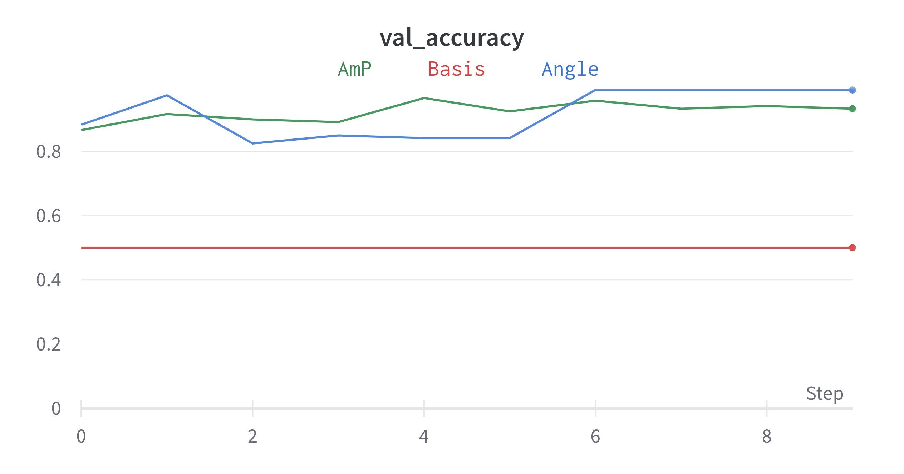
</div>

---

#### <span style="color: #F19C99">QCNN on EP</span>

- ElectronPhoton (only 900 train images)
    - Center cropped $\rightarrow$ (8,8)
    - Log Scaling followed by min max scaling
- Same Ansatz as previous (Not using DRC)
- AngleMap
- 20 epochs
- Acc: 0.61, Val Acc: 0.53

<div>
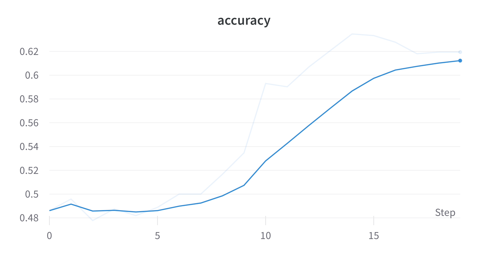
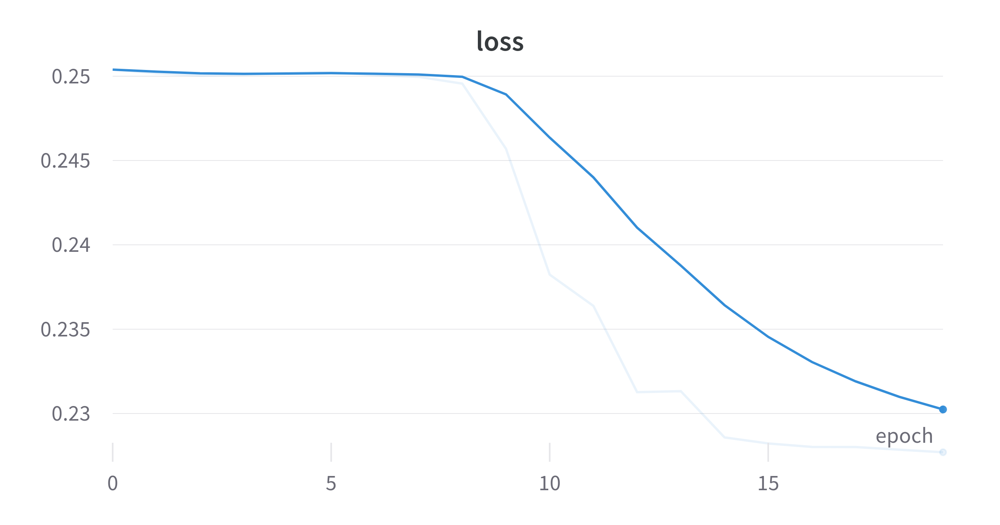
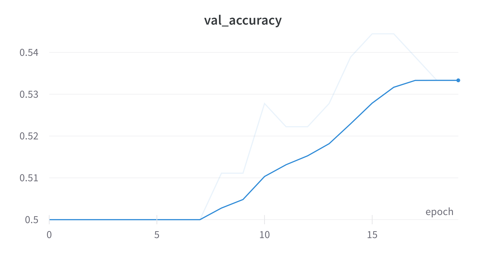
</div>
---

## <span style="color: #7EA6E0">More Architectures</span>

- Created QCNN hybrid model with FC layers at the end. (yet to test)
- Created a new ansatz TTN.

<div>
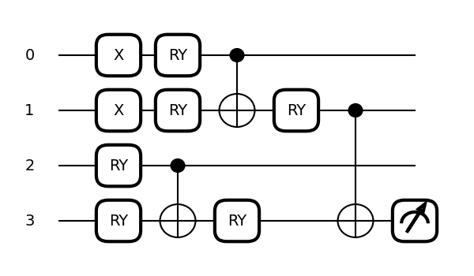
</div>

---

## <span style="color: #7EA6E0">Feature engineering EP</span>

- Flattened images into rows. Created a dataframe.
- Correlation of all columns with target.

```
target         1.000000
ind-(16,16)    0.153360
ind-(16,15)    0.120210
ind-(16,18)    0.104080
ind-(16,17)    0.065687
Name: target, dtype: float64
```
- Tried feature Agglomeration using xgboost as classifier

```
cluster: 1 train acc is: 68.36 prediction acc is: 49.60
cluster: 5 train acc is: 86.11 prediction acc is: 59.90
cluster: 6 train acc is: 88.34 prediction acc is: 59.40
cluster: 7 train acc is: 90.44 prediction acc is: 64.30
```
---

## <span style="color: #FFB570">Contd.</span>

- Train scores are higher than predicition scores.
- Even by restricting the number of features test scores does not increase.
- Need to spend more than on feature engineering on the dataset.

---

## Status
<div class="container">

<div class="col" >
<span style="color:#97D077"> Done: </span>

- Preliminary results on MNIST and EP (classical & quantum).
- Tried transfer learning.
- Tried feature engineering on EP.
</div>

<div class="col">
<span style="color:#7EA6E0"> Goals for next week: </span>

- Giving attention to EP.
- Transfer learning with VQC.
- Testing EP with TTN.
- Using QCNN Hybrid with EP.
</div>

<div class="col">
<span style="color:#F19C99"> Questions: </span>

- Any suggestions on how to feature engineer EP?
- Any other feedback?

</div>

</div>


---

## References

- Cong, I., Choi, S. & Lukin, M.D. Quantum convolutional neural networks. Nat. Phys. 15, 1273–1278 (2019). https://doi.org/10.1038/s41567-019-0648-8
- S.~Y.~C.~Chen, T.~C.~Wei, C.~Zhang, H.~Yu and S.~Yoo, ``Quantum convolutional neural networks for high energy physics data analysis,'' Phys. Rev. Res. \textbf{4} (2022) no.1, 013231 doi:10.1103/PhysRevResearch.4.013231
- Liu, J., Lim, K.H., Wood, K.L. et al. Hybrid quantum-classical convolutional neural networks. Sci. China Phys. Mech. Astron. 64, 290311 (2021). https://doi.org/10.1007/s11433-021-1734-3
- Tüysüz, C., Rieger, C., Novotny, K. et al. Hybrid quantum classical graph neural networks for particle track reconstruction. Quantum Mach. Intell. 3, 29 (2021). https://doi.org/10.1007/s42484-021-00055-9
- Pérez-Salinas, A., Cervera-Lierta, A., Gil-Fuster, E., & Latorre, J. (2020). Data re-uploading for a universal quantum classifier. Quantum, 4, 226.
- Chen, Yusui & Hu, Wenhao & Li, Xiang. (2021). Feasible Architecture for Quantum Fully Convolutional Networks.
- Chen, Yixiong. (2021). QDCNN: Quantum Dilated Convolutional Neural Network.

