# Where the Magic Happens

---
revealOptions:
  transition: 'fade'
  transitionSpeed: 'fast'
  width: 1400
---
<style>
.container{
    display: flex;
}
.col{
    flex: 1;
}
.small-font{
    font-size:25px;
}
</style>

## Quark Gluon ECAL

- Cropped to 40 x 40
- Log Scaled
- Standardize

<div>
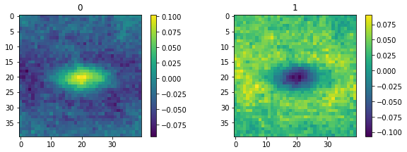
</div>

---

#### Classical Models

Quark Gluon ECAL - ResnetV2 - Depths 20, 44 - 100 epochs

| Depth      | Acc | Val acc|
| ----- | ----- | ----- |
| 20    |0.99      | 0 .58     |
| 56   | 0.99       | 0.561       |
| 110   | 0.99       | 0.58      |

<div>
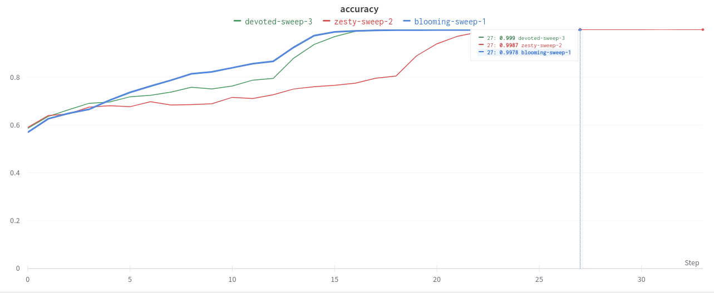
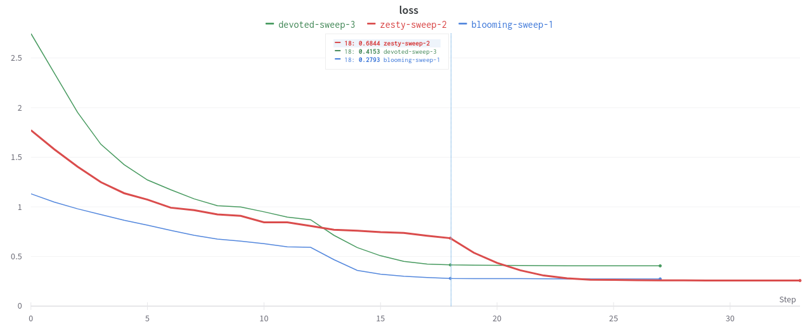
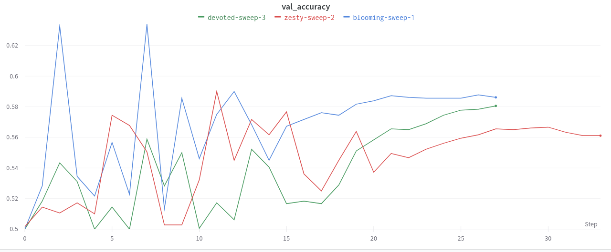
</div>

---

### Results on Pretrained model

- Resnet50 $\rightarrow$ 512 $\rightarrow$ 128 $\rightarrow$ 2
- Using Log scaling with Ranger Optimizer
- Acc: 0.6621, Val Acc: 0.6133

<div>
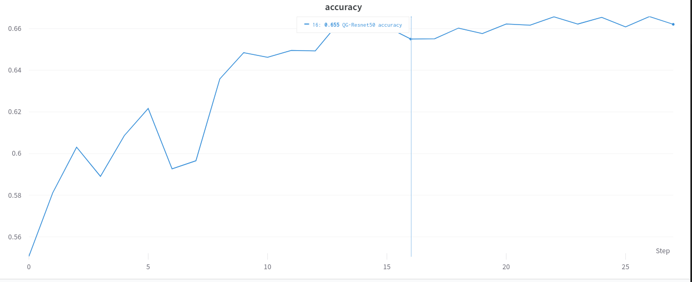
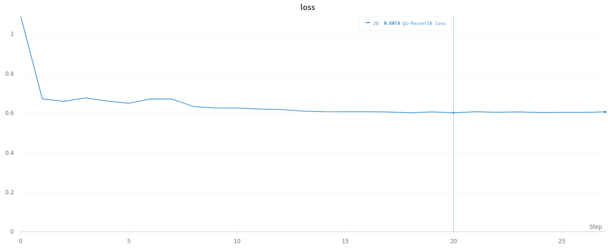
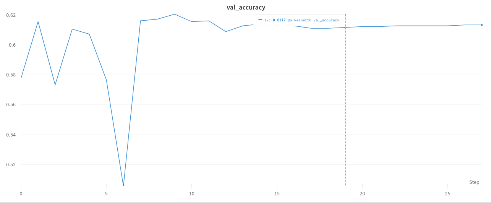
</div>
---

### Results on Quantum CNN

- Quark Gluon
    - 0 1 images
    - 360 images per class
    - Center cropped $\rightarrow$ (40,40)
    - Log Scaling
    - Standardize
- DRC Ansatz
- Feature maps: No need
- 20 epochs
---

#### QCNN on Quark Gluon

```
_________________________________________________________________
 Layer (type)                Output Shape              Param #   
=================================================================
 input_1 (InputLayer)        [(None, 40, 40, 1)]       0         
                                                                 
 qconv2d_1 (QConv2D)         (None, 20, 20, 1)         80        
                                                                 
 qconv2d_2 (QConv2D)         (None, 10, 10, 1)         80        
                                                                 
 flatten (Flatten)           (None, 100)               0         
                                                                 
 NQubitPQC (NQubitPQC)       (None, 1)                 808       
                                                                 
=================================================================
```
```
Total params: 968
Trainable params: 968
Non-trainable params: 0
```
---

#### Quantum Circuit

```
                                 ┌──┐
(0, 0): ───H───Y^w0───@───Y^w4─────@────
                      │            │
(0, 1): ───H───Y^w1───@───Y^w5────@┼────
                                  ││
(0, 2): ───H───Y^w2───@───Y^w6────@┼────
                      │            │
(0, 3): ───H───Y^w3───@───Y^w7─────@────
                                 └──┘
```

<div class="container">

<div class="col">
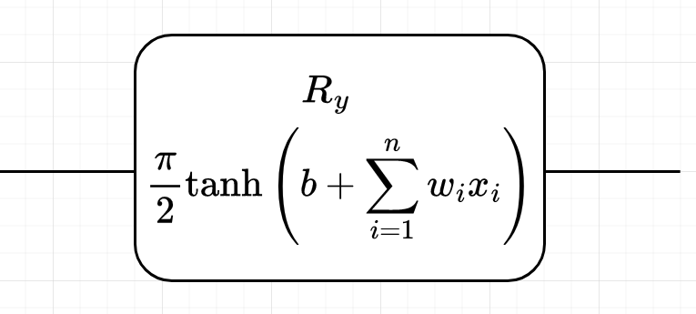
</div>

<div class="col">
<ul>
    <li>Kernel size: 3 x 3</li>
    <li> Strides: 2 x 2</li>
</ul>
</div>

</div>

---

#### Results

| Acc | Val acc|
| ----- | ----- |
|0.5      | 0 .5    |

<div>
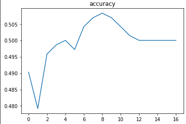
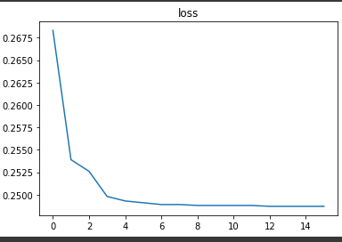
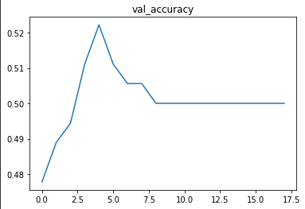
</div>

---

## <span style="color: #7EA6E0">Layerwise learning</span>

<div>
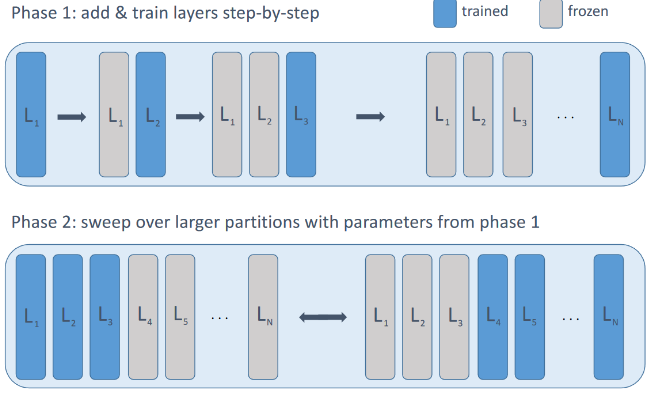
</div>

- Train small layers for fixed epochs. Add new layers, freeze previous layers.
- Repeat for desired depth.
- Additional optimization of larger subsets of layers.

---


## Status
<div class="container">

<div class="col" >
<span style="color:#97D077"> Done: </span>

- Preliminary results on Quark Gluon (classical & quantum).
- [WIP] Layerwise learning for Quark Gluon
</div>

<div class="col">
<span style="color:#7EA6E0"> Goals for next week: </span>

- Train classical models with less params to avoid overfit.
- Train Quark Gluon with layerwise learning with small and then large number of samples.
- Setup TPU on GCP if possible.
</div>

<div class="col">
<span style="color:#F19C99"> Questions: </span>

- Suggestions on training with larger number of samples as it takes significant time?
- Any other feedback?

</div>

</div>


---

## References

- Cong, I., Choi, S. & Lukin, M.D. Quantum convolutional neural networks. Nat. Phys. 15, 1273–1278 (2019). https://doi.org/10.1038/s41567-019-0648-8
- S.~Y.~C.~Chen, T.~C.~Wei, C.~Zhang, H.~Yu and S.~Yoo, ``Quantum convolutional neural networks for high energy physics data analysis,'' Phys. Rev. Res. \textbf{4} (2022) no.1, 013231 doi:10.1103/PhysRevResearch.4.013231
- Liu, J., Lim, K.H., Wood, K.L. et al. Hybrid quantum-classical convolutional neural networks. Sci. China Phys. Mech. Astron. 64, 290311 (2021). https://doi.org/10.1007/s11433-021-1734-3
- Tüysüz, C., Rieger, C., Novotny, K. et al. Hybrid quantum classical graph neural networks for particle track reconstruction. Quantum Mach. Intell. 3, 29 (2021). https://doi.org/10.1007/s42484-021-00055-9
- Pérez-Salinas, A., Cervera-Lierta, A., Gil-Fuster, E., & Latorre, J. (2020). Data re-uploading for a universal quantum classifier. Quantum, 4, 226.
- Chen, Yusui & Hu, Wenhao & Li, Xiang. (2021). Feasible Architecture for Quantum Fully Convolutional Networks.
- Chen, Yixiong. (2021). QDCNN: Quantum Dilated Convolutional Neural Network.
