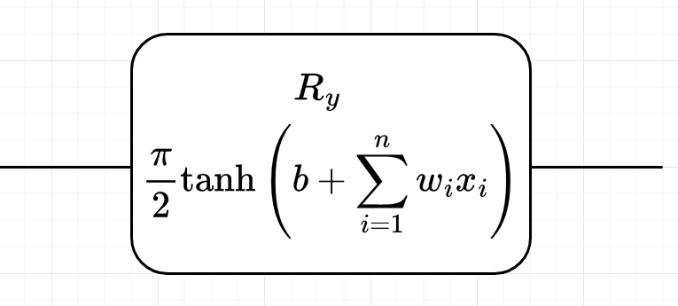

---
revealOptions:
  transition: 'fade'
  transitionSpeed: 'fast'
  width: 1400
---
<style>
.container{
    display: flex;
}
.col{
    flex: 1;
}
.small-font{
    font-size:20px;
}

</style>

#### TPU setup on Google Cloud

- Was able to setup TPU.
- But, currently does not support <em>tf.string</em> data type which is used by <em>tfq.ControlledPQC</em>.

<hr>

#### GPU-based quantum simulation with qsimcirq

- Tried qsimcirq with GPU and NVIDIA cuQuantum SDK
- Much slower than the default backend, may be due to less number of qubits.

<hr>

#### Alternatives

- Using Pennylane + TF on GPU for faster training.

---


### Results on Quantum CNN

- Quark Gluon
    - 0 1 images
    - 500 images per class
    - Center cropped $\rightarrow$ (40,40)
    - Log Scaling
    - Standardize
- DRC Ansatz
- Feature maps: No need
- Layerwise learning
---

#### QCNN on Quark Gluon

```
 Layer (type)                Output Shape              Param #   
=================================================================
 input_10 (InputLayer)       [(None, 8, 8, 1)]         0         
                                                                 
 qconv2d_1 (QConv2D)         (None, 4, 4, 1)           80        
                                                                 
 max_pooling2d_9 (MaxPooling  (None, 2, 2, 1)          0         
 2D)                                                             
                                                                 
 flatten_8 (Flatten)         (None, 4)                 0         
                                                                 
 dense_18 (Dense)            (None, 8)                 40        
                                                                 
 dense_19 (Dense)            (None, 2)                 18                           
=================================================================
```
---

#### Quantum Circuit

```
(0, 0): ───H───Y^w0───@───Y^w2───@───Y^w4───@───Y^w6───@───
                      │          │          │          │
(0, 1): ───H───Y^w1───@───Y^w3───@───Y^w5───@───Y^w7───@───

```

<div class="container">

<div class="col">

</div>

<div class="col">
<ul>
    <li>Kernel size: 3 x 3</li>
    <li> Strides: 2 x 2</li>
</ul>
</div>
---

###### Results


<hr>


---

#### QCNN on Quark Gluon

```
 Layer (type)                Output Shape              Param #   
=================================================================
 input_10 (InputLayer)       [(None, 40, 40, 1)]       0         
                                                                 
 qconv2d_1 (QConv2D)         (None, 20, 20, 1)         320       
                                                                 
 max_pooling2d_9 (MaxPooling  (None, 10, 10, 1)        0         
 2D)                                                             
                                                                 
 flatten_7 (Flatten)         (None, 100)               0         
                                                                 
 dense_18 (Dense)            (None, 8)                 808       
                                                                 
 dense_19 (Dense)            (None, 2)                 18                     
=================================================================
```
---

#### Quantum Circuit

```
                                 ┌──┐                       ┌──┐                       ┌──┐                       ┌──┐
(0, 0): ───H───Y^w0───@───Y^w4─────@────Y^w8────@───Y^w12─────@────Y^w16───@───Y^w20─────@────Y^w24───@───Y^w28─────@────
                      │            │            │             │            │             │            │             │
(0, 1): ───H───Y^w1───@───Y^w5────@┼────Y^w9────@───Y^w13────@┼────Y^w17───@───Y^w21────@┼────Y^w25───@───Y^w29────@┼────
                                  ││                         ││                         ││                         ││
(0, 2): ───H───Y^w2───@───Y^w6────@┼────Y^w10───@───Y^w14────@┼────Y^w18───@───Y^w22────@┼────Y^w26───@───Y^w30────@┼────
                      │            │            │             │            │             │            │             │
(0, 3): ───H───Y^w3───@───Y^w7─────@────Y^w11───@───Y^w15─────@────Y^w19───@───Y^w23─────@────Y^w27───@───Y^w31─────@────
                                 └──┘                       └──┘                       └──┘                       └──┘


```

<div class="container">

<div class="col">

</div>

<div class="col">
<ul>
    <li>Kernel size: 3 x 3</li>
    <li> Strides: 2 x 2</li>
</ul>
</div>
---

###### Results


<hr>


---


## Status
<div class="container">

<div class="col" >
<span style="color:#97D077"> Done: </span>

- Utitlizing TPU and QsimCirq with GPU
- Layerwise learning for Quark Gluon dataset
</div>

<div class="col">
<span style="color:#7EA6E0"> Goals for next week: </span>

- Integrate Pennylane with TF and Cirq.
- Train model with more number of qubits on GPU on Quark Gluon.
- Reducing number of datapoints per qubits and using more gates.
</div>

<div class="col">
<span style="color:#F19C99"> Questions: </span>

- Is 1000 samples enough? 
- Will increasing the number of QConv2D layers help?

</div>

</div>


---

## References

<div class='small-font'>
    <ul>    
        <li> Cong, I., Choi, S. & Lukin, M.D. Quantum convolutional neural networks. Nat. Phys. 15, 1273–1278 (2019). https://doi.org/10.1038/s41567-019-0648-8</li>
        <li>S.~Y.~C.~Chen, T.~C.~Wei, C.~Zhang, H.~Yu and S.~Yoo, ``Quantum convolutional neural networks for high energy physics data analysis,''
Phys. Rev. Res. \textbf{4} (2022) no.1, 013231 doi:10.1103/PhysRevResearch.4.013231</li>
        <li>Liu, J., Lim, K.H., Wood, K.L. et al. Hybrid quantum-classical convolutional neural networks. Sci. China Phys. Mech. Astron. 64, 290311 (2021). https://doi.org/10.1007/s11433-021-1734-3</li>
        <li>Tüysüz, C., Rieger, C., Novotny, K. et al. Hybrid quantum classical graph neural networks for particle track reconstruction. Quantum Mach. Intell. 3, 29 (2021). https://doi.org/10.1007/s42484-021-00055-9</li>
        <li>Pérez-Salinas, A., Cervera-Lierta, A., Gil-Fuster, E., & Latorre, J. (2020). Data re-uploading for a universal quantum classifier. Quantum, 4, 226.</li>
        <li>Chen, Yusui & Hu, Wenhao & Li, Xiang. (2021). Feasible Architecturere for Quantum Fully Convolutional Networks. </li>
        <li>Chen, Yixiong. (2021). QDCNN: Quantum Dilated Convolutional Neural Network. </li>
    </ul>
</div>

