---
revealOptions:
  transition: 'fade'
  transitionSpeed: 'fast'
  width: 1400
---
<style>
.container{
    display: flex;
}
.col{
    flex: 1;
}
.small-font{
    font-size:20px;
}

/* - Quark Gluon
    - 0 1 images
    - 500 images per class
    - Center cropped $\rightarrow$ (40,40)
    - Log Scaling
    - Standardize
- DRC Ansatz
- Feature maps: No need
- Layerwise learning */

</style>

### QCNN Hybrid Architecture

- Using 1 and 2 qubits due to longer training time with more qubits.
- Dense layers of 8 and 2 units after ansatz.

<div class="col">

</div>

```
 ───H───Z^w0───Y^w1───Z^w2───
```
- For a kernel size of $(k,k)$ each gate has $k^2 + 1$ params.

---

### QCNN Hybrid Architecture Single Qubit

```
  Layer (type)                Output Shape              Param #
=================================================================
 input_1 (InputLayer)        [(None, 8, 8, 1)]         0
 qconv2d_1 (QConv2D)         (None, 6, 6, 1)           30
 flatten (Flatten)           (None, 36)                0
 dense (Dense)               (None, 8)                 296
 dense_1 (Dense)             (None, 2)                 18
=================================================================
Total params: 344
Trainable params: 344
Non-trainable params: 0
```
```
(0, 0): ───H───Z^w0───Y^w1───Z^w2───
```
---

### QCNN Hybrid Architecture 2 Qubits

```
Layer (type)                Output Shape              Param #
=================================================================
 input_1 (InputLayer)        [(None, 8, 8, 1)]         0
 qconv2d_1 (QConv2D)         (None, 6, 6, 6)           60
 flatten (Flatten)           (None, 216)               0
 dense (Dense)               (None, 8)                 1736
 dense_1 (Dense)             (None, 2)                 18
=================================================================
Total params: 1,814
Trainable params: 1,814
Non-trainable params: 0
```
```
(0, 0): ───H───Z^w0───Y^w1───Z^w2───@───
                                    │
(0, 1): ───H───Z^w3───Y^w4───Z^w5───@───
```
---

#### All-Qubit Multi-Observable Measurement Strategy*

$$
m_{AMM} =\left( m_{q_0,σ_x}, m_{q_0,σ_y}, m_{q_0,σ_z},\dots,m_{q_{n−1},σ_x},m_{q_{n−1},σ_y},m_{q_{n−1},σ_z}\right)
$$


- *[A Multi-Classification Hybrid Quantum Neural Network Using an All-Qubit Multi-Observable Measurement Strategy](https://www.mdpi.com/1099-4300/24/3/394)

---

### Datasets

- For both Electron-Photon (8,8) and Quark-Gluon (40,40)
    - Log Scaling
    - Standardize

- Electron Photon
    - Train: 7200, Val: 1800, Test: 1000

- Quark Gluon
    - Train: 1000, Val: 250, Test: 138

---
## Results for EP single qubit

<p class='small-font'>train acc: 0.59 | val acc: 0.55</p>


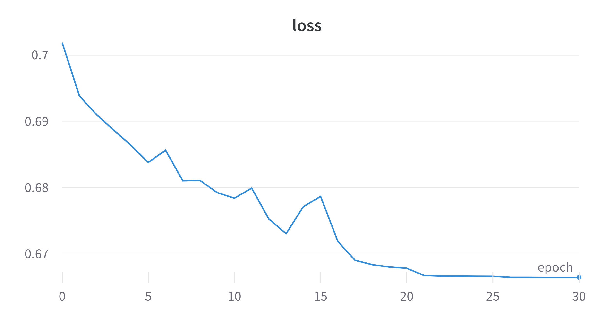
<br>
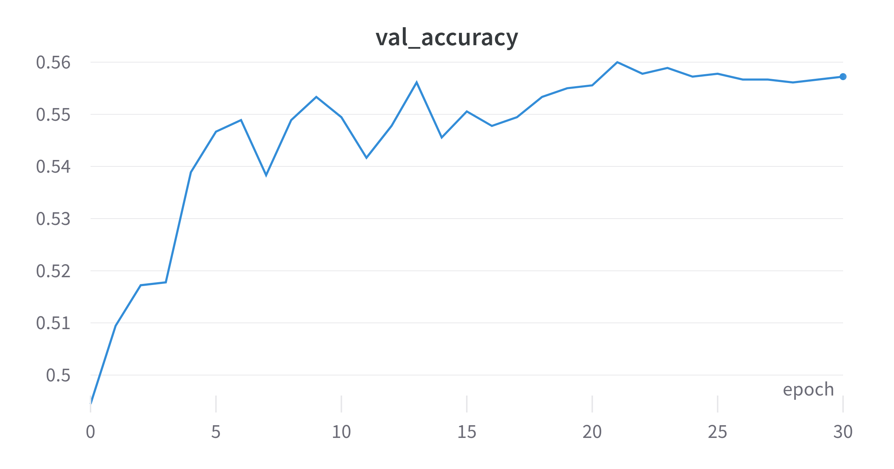
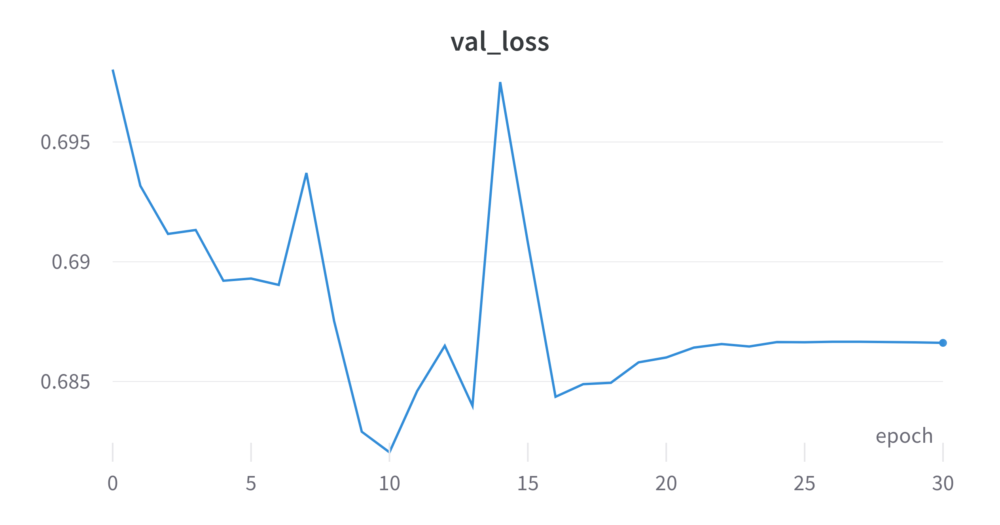

---

## Results for EP 2 qubits

<p class='small-font'>train acc: 0.7168  | val acc: 0.55</p>

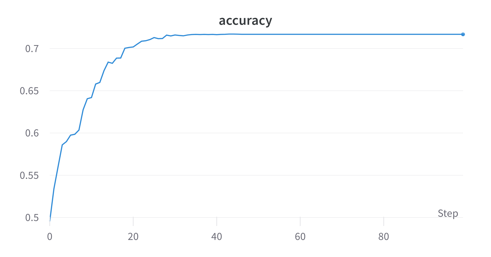
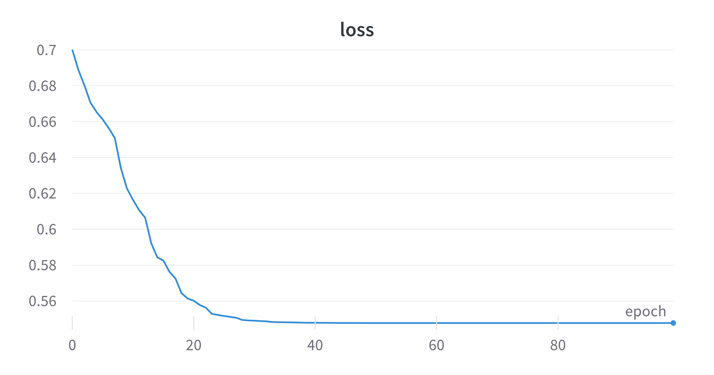
<br>
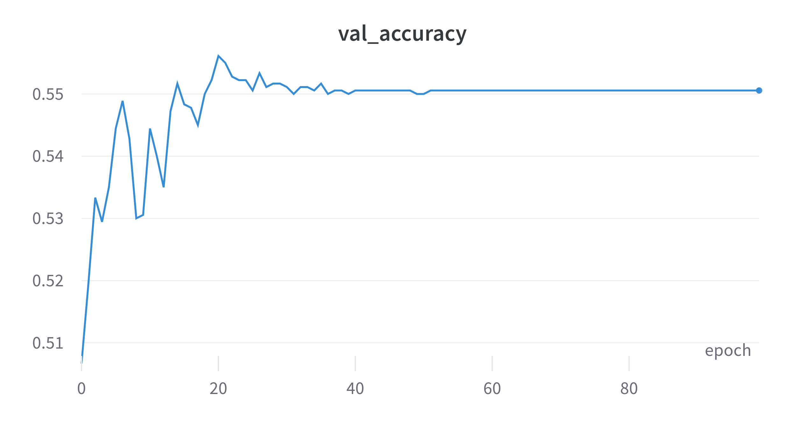
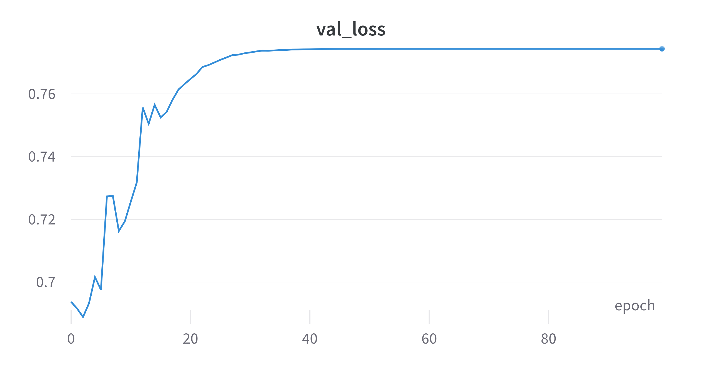

---

## Results for QG single qubit

<p class='small-font'>train acc: 0.8380 | val acc: 0.576</p>

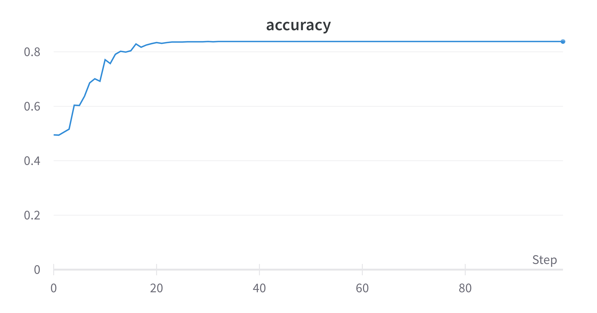
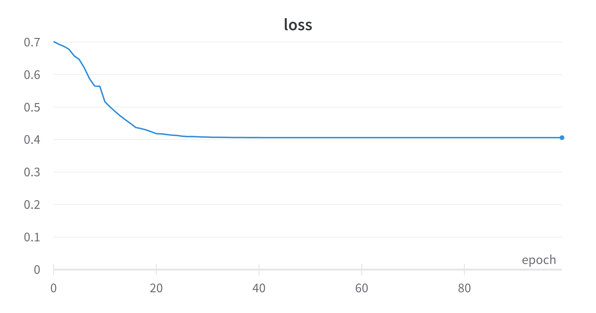
<br>
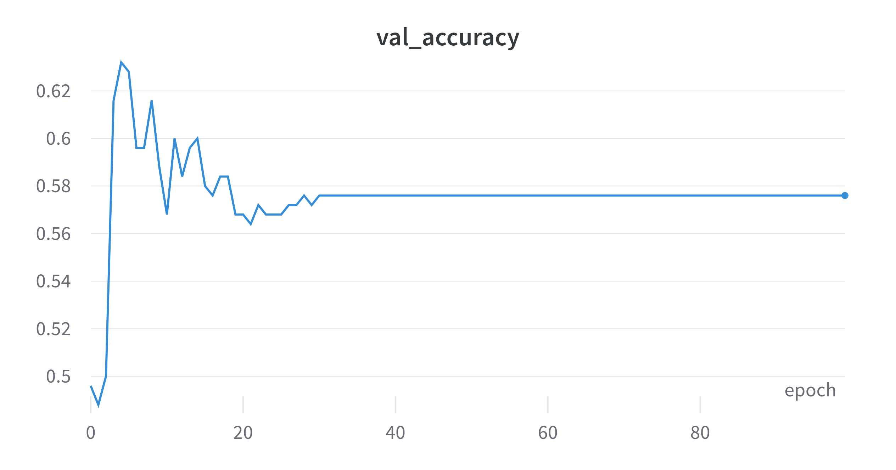
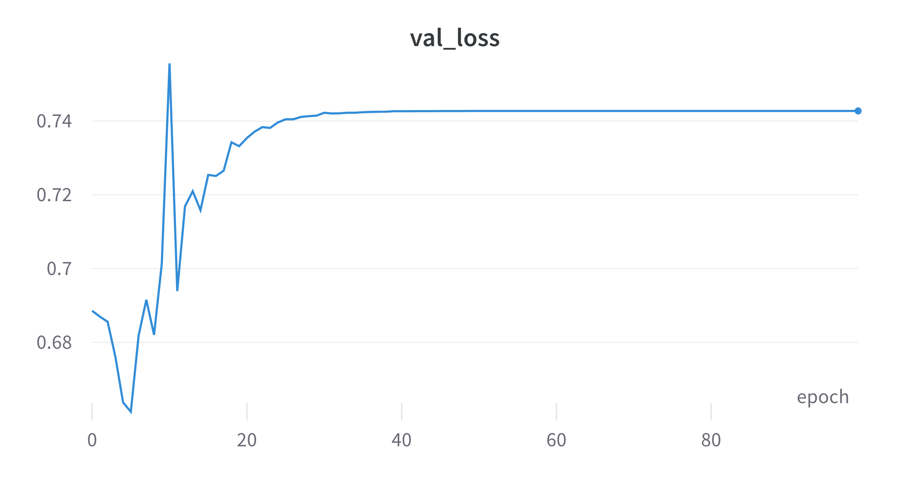

---


## Status
<div class="container">

<div class="col" >
<span style="color:#97D077"> Done: </span>

- Trained QCNNHybrid on EP and QG. Models are overfitting.
</div>

<div class="col">
<span style="color:#7EA6E0"> Goals for next week: </span>

- Training with more samples.
- Will try to use dropout layer.
- Can increase qubits at the expense of time.
- Adding more QConv2D layers.
</div>

<div class="col">
<span style="color:#F19C99"> Questions: </span>

- Is 1000 samples enough? 
- Will increasing the number of QConv2D layers help?

</div>

</div>

