---
revealOptions:
  transition: 'fade'
  transitionSpeed: 'fast'
  width: 1400
---
<style>
.container{
    display: flex;
}
.col{
    flex: 1;
}
.small-font{
    font-size:20px;
}

/* - Quark Gluon
    - 0 1 images
    - 500 images per class
    - Center cropped $\rightarrow$ (40,40)
    - Log Scaling
    - Standardize
- DRC Ansatz
- Feature maps: No need
- Layerwise learning */

</style>

###### Results on EP dataset with QCNN Hybrid

<p class='small-font'>10k samples - 2 QConv2D Layers - 2 qubits per layer - 1 Dropout between FC layers</p>
<p class='small-font'>train acc: 0.6515 | val_acc: 0.5522</p>

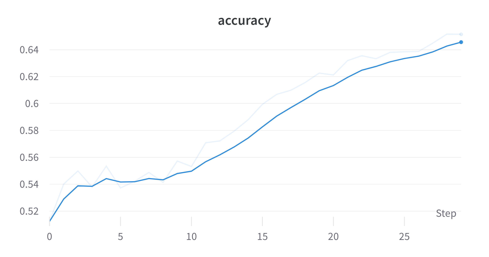
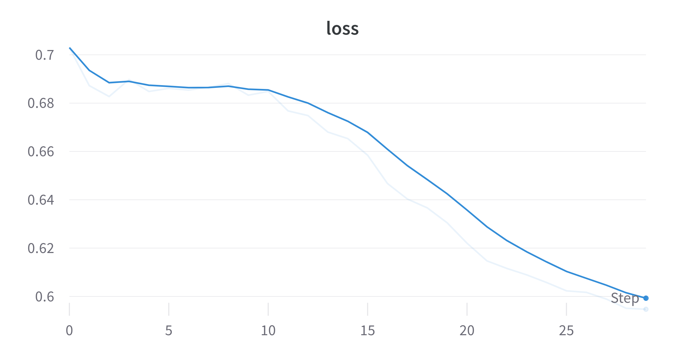
<br>
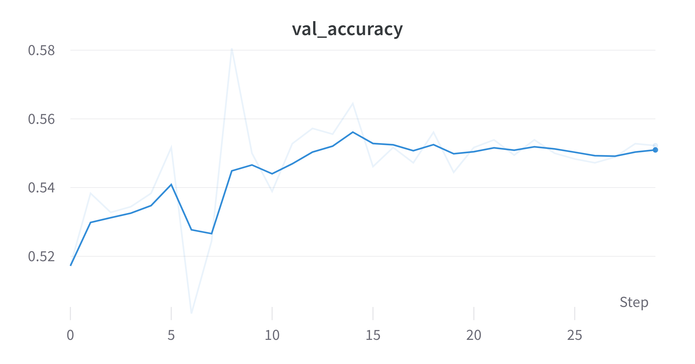
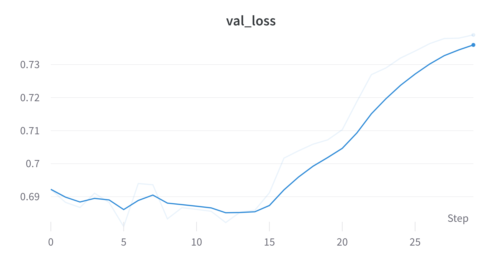

---

<p class='small-font'>10k samples - 1 QConv2D Layer - 2 qubits - Kernel (2,2) </p>
<p class='small-font'>train acc: 0.6772 | val_acc: 0.5738</p>

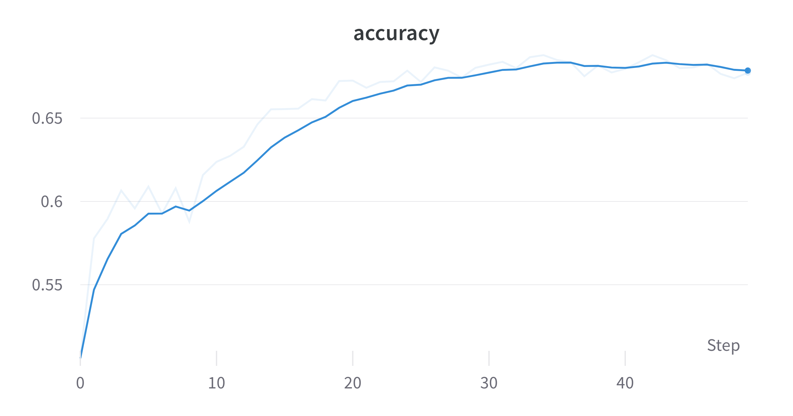
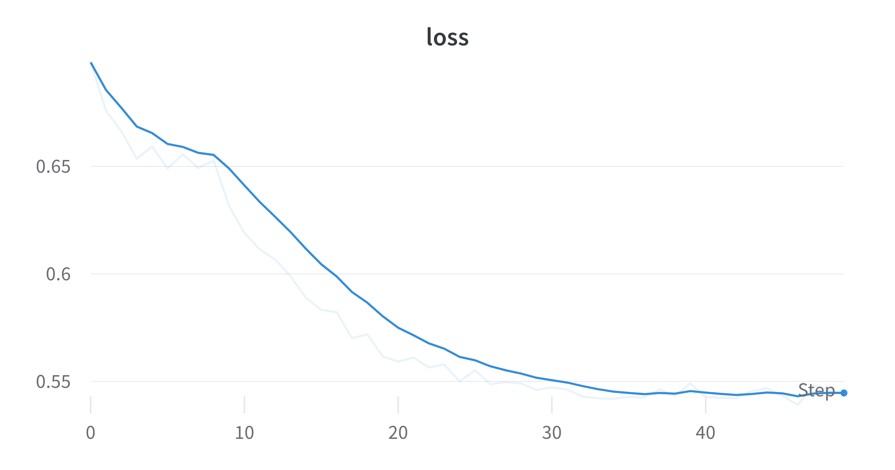
<br>
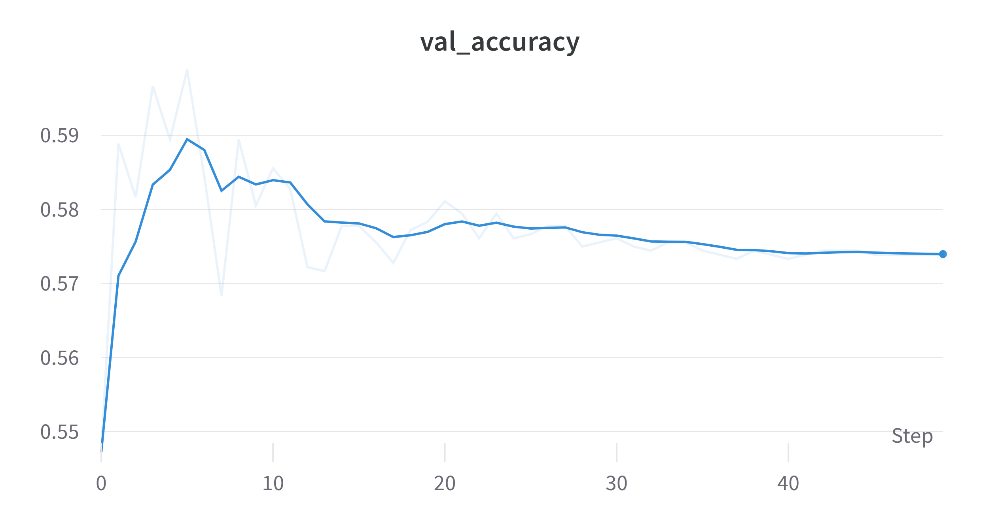
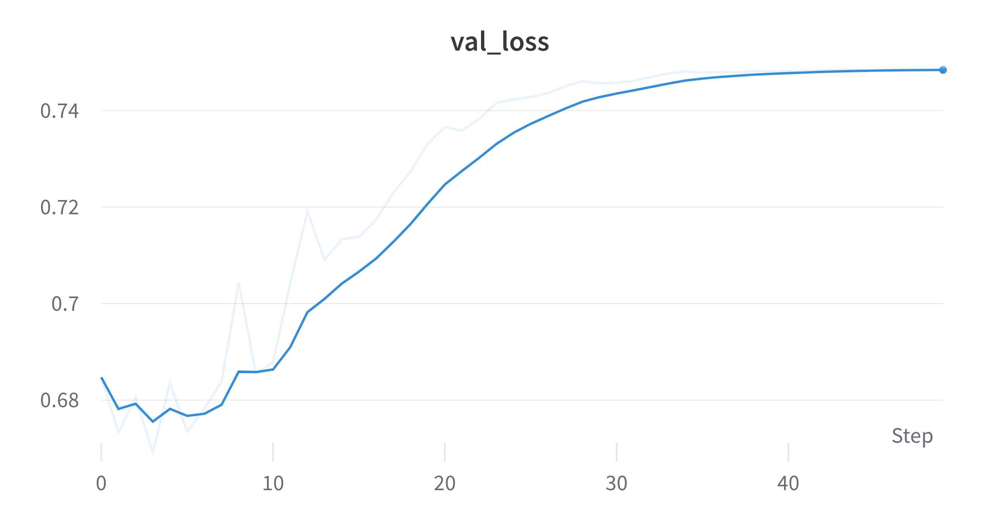

---

<p class='small-font'>100k samples - 1 QConv2D Layer - 2 qubits - 10 epochs only </p>
<p class='small-font'>train acc: 0.5976 | val_acc: 0.6399</p>

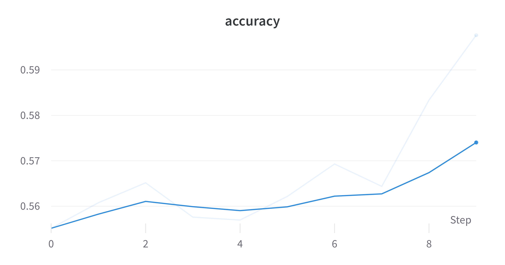
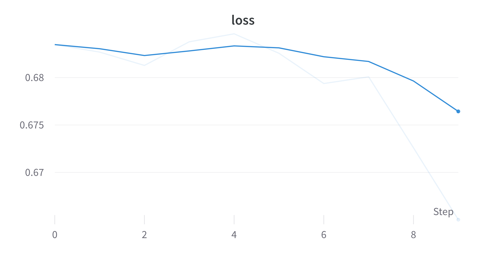
<br>
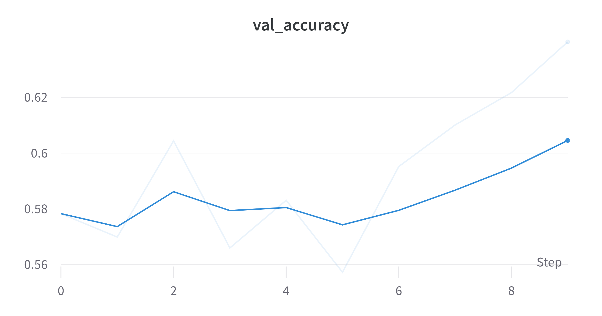
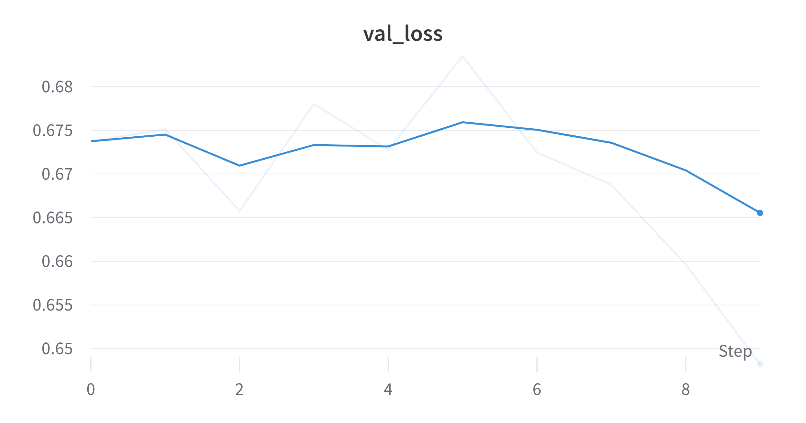

---

Models with less data (10k) starts to overfit while models with large data (100k) might have some potential but takes quite a time.

---

###### Using JAX with pennylane

- Results in huge speedup even on cpu.
- jax.vmap transform to make running batches of circuits much easier. 
- vmap essentially transforms a single quantum computer into multiple running in parallel!
---
###### Preliminary Results on MNIST
Binary classes: 3 and 6. Center crop to (20,20). Resized to (8,8). Standardized

```
╒════════╤══════════════════╤═════════════════╤═════════════════╤═══════════╕
│ Data   │ Train size       │ Val size        │ Test size       │ Dims      │
╞════════╪══════════════════╪═════════════════╪═════════════════╪═══════════╡
│ X      │ (10844, 8, 8, 1) │ (1205, 8, 8, 1) │ (1968, 8, 8, 1) │ (8, 8, 1) │
├────────┼──────────────────┼─────────────────┼─────────────────┼───────────┤
│ y      │ (10844, 2)       │ (1205, 2)       │ (1968, 2)       │ (2,)      │
╘════════╧══════════════════╧═════════════════╧═════════════════╧═══════════╛
```
```
╒══════════════╤═══════╤═══════╤════════╤═══════╤══════════════════════════╕
│ Type         │   Min │   Max │   Mean │   Std │ Samples for each class   │
╞══════════════╪═══════╪═══════╪════════╪═══════╪══════════════════════════╡
│ Train Images │ -1.77 │ 23.08 │   0    │  1    │ [5326, 5518]             │
├──────────────┼───────┼───────┼────────┼───────┼──────────────────────────┤
│ Val Images   │ -1.77 │ 16.33 │  -0    │  1    │ [592, 613]               │
├──────────────┼───────┼───────┼────────┼───────┼──────────────────────────┤
│ Test Images  │ -1.77 │ 15.09 │   0.02 │  1.01 │ [958, 1010]              │
╘══════════════╧═══════╧═══════╧════════╧═══════╧══════════════════════════╛
```
---

### Model Architecture

Padding: Same - Kernel: (3,3): Strides: (1,1)


---

###### Results

<p class='small-font'>1 QConv2D Layer - 1 qubit - 5 epochs only </p>
<p class='small-font'>train acc: 0.9956 | val_acc: 0.9856</p>

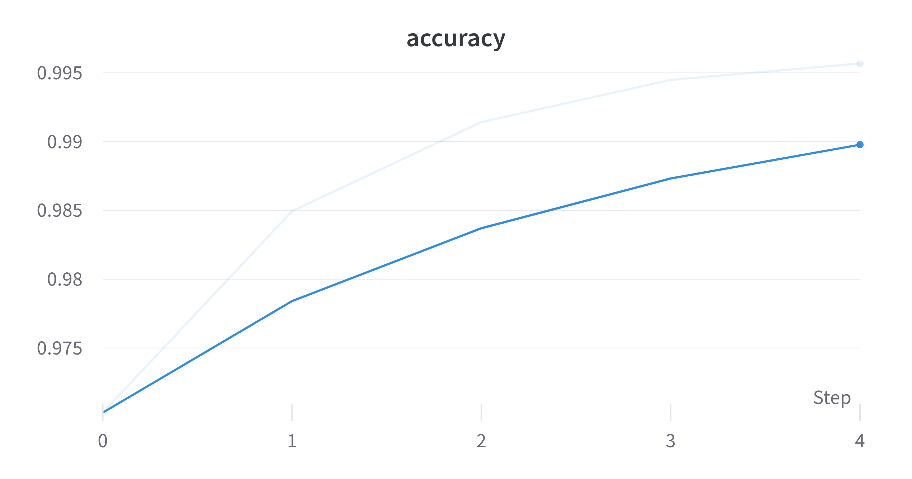
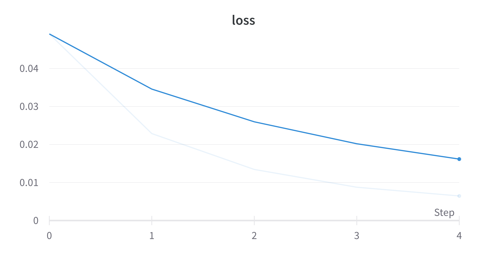
<br>
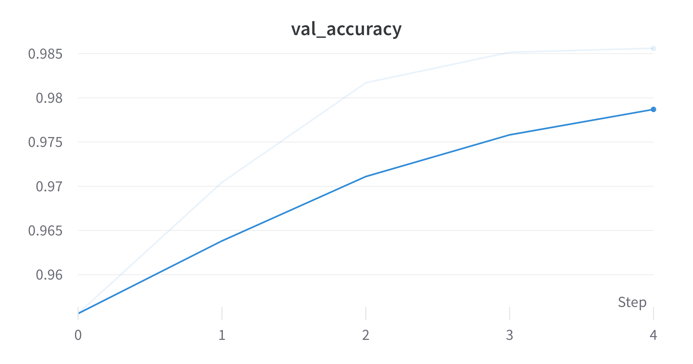
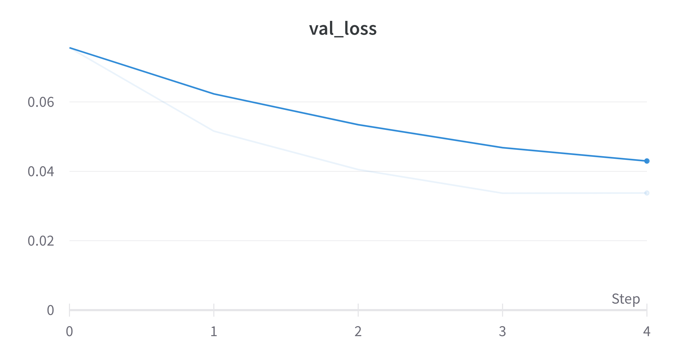

---

###### Results on EP
Center crop to (8,8).  Standardized
```
╒════════╤══════════════════╤══════════════════╤══════════════════╤═══════════╕
│ Data   │ Train size       │ Val size         │ Test size        │ Dims      │
╞════════╪══════════════════╪══════════════════╪══════════════════╪═══════════╡
│ X      │ (90000, 8, 8, 1) │ (10000, 8, 8, 1) │ (20000, 8, 8, 1) │ (8, 8, 1) │
├────────┼──────────────────┼──────────────────┼──────────────────┼───────────┤
│ y      │ (90000, 2)       │ (10000, 2)       │ (20000, 2)       │ (2,)      │
╘════════╧══════════════════╧══════════════════╧══════════════════╧═══════════╛
```
```
╒══════════════╤═══════╤════════╤════════╤═══════╤══════════════════════════╕
│ Type         │   Min │    Max │   Mean │   Std │ Samples for each class   │
╞══════════════╪═══════╪════════╪════════╪═══════╪══════════════════════════╡
│ Train Images │ -2.88 │ 106.87 │      0 │  1    │ [45000, 45000]           │
├──────────────┼───────┼────────┼────────┼───────┼──────────────────────────┤
│ Val Images   │ -2.88 │  58.46 │     -0 │  0.99 │ [5000, 5000]             │
├──────────────┼───────┼────────┼────────┼───────┼──────────────────────────┤
│ Test Images  │ -2.88 │  64.88 │     -0 │  0.98 │ [10000, 10000]           │
╘══════════════╧═══════╧════════╧════════╧═══════╧══════════════════════════╛
```
---

###### Results

<p class='small-font'>1 QConv2D Layer - 1 qubit - 10 epochs only </p>
<p class='small-font'>train acc: 0.6641 | val_acc: 0.6593</p>

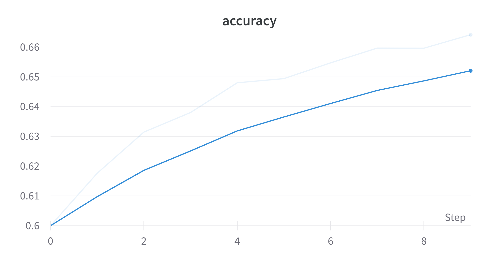
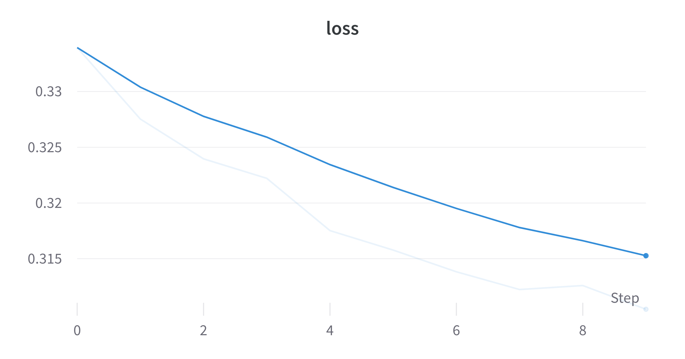
<br>
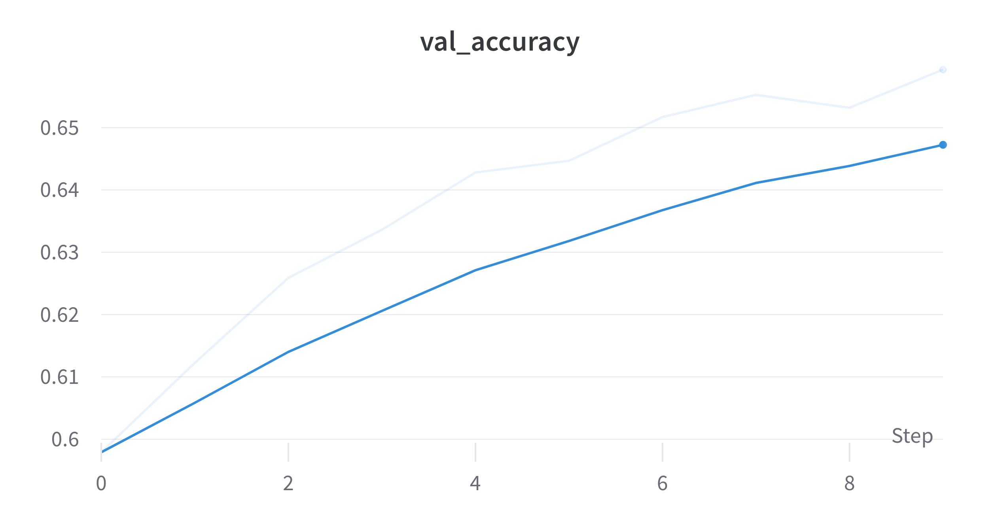
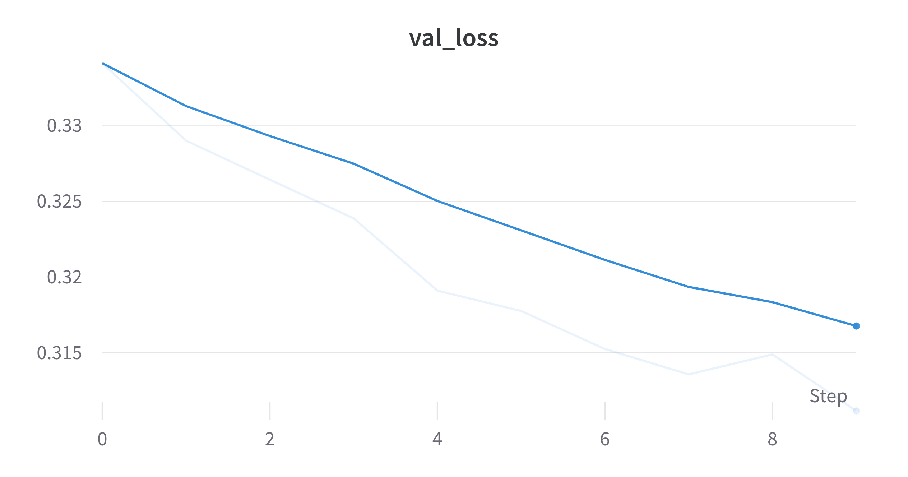

---

##### Comparing TFQ and JAX for EP

In the same settings on CPU
- TFQ takes roughly 15-20 mins per epoch whereas JAX takes 5-6 seconds. 
- The first epoch of JAX took 16s whereas for TFQ its ~18 mins.

Some drawbacks of JAX
- Had to code the Architecture from scratch including NN layers, loss calculation and gradient updation.

---

## Status
<div class="container">

<div class="col" >
<span style="color:#97D077"> Done: </span>

- Trained QCNNHybrid on EP with TFQ. Models are overfitting or takes very long time.
- Created QCNN and JAX and done preliminary training on MNIST and EP.
</div>

<div class="col">
<span style="color:#7EA6E0"> Goals for next week: </span>

- Training with more samples for EP and QG.
- Training on TPU for larger datasets.
- Tuning Hyperparameters to get best results.
</div>

<div class="col">
<span style="color:#F19C99"> Questions: </span>

- Any feedback on JAX?
- Any other feedback?

</div>

</div>

