---
revealOptions:
  transition: 'fade'
  transitionSpeed: 'fast'
  width: 1400
---
<style>
.container{
    display: flex;
}
.col{
    flex: 1;
}
.small-font{
    font-size:20px;
}

</style>


## Using JAX with pennylane

- Results in huge speedup even on cpu.
- jax.vmap transform to make running batches of circuits much easier. 
- vmap essentially transforms a single quantum computer into multiple running in parallel!

---

### Model Architecture

Padding: Same - Kernel: (3,3): Strides: (1,1)

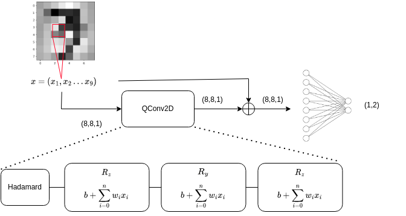

---

## Results on EP
Center crop to (8,8).  Standardized
```
╒════════╤══════════════════╤══════════════════╤══════════════════╤═══════════╕
│ Data   │ Train size       │ Val size         │ Test size        │ Dims      │
╞════════╪══════════════════╪══════════════════╪══════════════════╪═══════════╡
│ X      │ (90000, 8, 8, 1) │ (10000, 8, 8, 1) │ (20000, 8, 8, 1) │ (8, 8, 1) │
├────────┼──────────────────┼──────────────────┼──────────────────┼───────────┤
│ y      │ (90000, 2)       │ (10000, 2)       │ (20000, 2)       │ (2,)      │
╘════════╧══════════════════╧══════════════════╧══════════════════╧═══════════╛
```
```
╒══════════════╤═══════╤════════╤════════╤═══════╤══════════════════════════╕
│ Type         │   Min │    Max │   Mean │   Std │ Samples for each class   │
╞══════════════╪═══════╪════════╪════════╪═══════╪══════════════════════════╡
│ Train Images │ -2.88 │ 106.87 │      0 │  1    │ [45000, 45000]           │
├──────────────┼───────┼────────┼────────┼───────┼──────────────────────────┤
│ Val Images   │ -2.88 │  58.46 │     -0 │  0.99 │ [5000, 5000]             │
├──────────────┼───────┼────────┼────────┼───────┼──────────────────────────┤
│ Test Images  │ -2.88 │  64.88 │     -0 │  0.98 │ [10000, 10000]           │
╘══════════════╧═══════╧════════╧════════╧═══════╧══════════════════════════╛
```
---

## Results

<p class='small-font'>1 QConv2D Layer</p>
<p class='small-font'>Best Test Acc: <b>0.6998</b>  |  AUC: <b>0.7518</b></p>

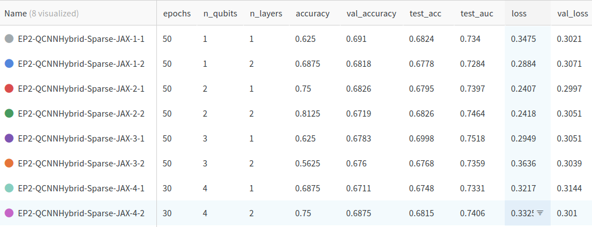
---

## Results on QG
Center crop to (40,40). Log Scaled. Standardized. 
```
╒════════╤════════════════════╤═══════════════════╤════════════════════╤═════════════╕
│ Data   │ Train size         │ Val size          │ Test size          │ Dims        │
╞════════╪════════════════════╪═══════════════════╪════════════════════╪═════════════╡
│ X      │ (95000, 40, 40, 1) │ (5000, 40, 40, 1) │ (20000, 40, 40, 1) │ (40, 40, 1) │
├────────┼────────────────────┼───────────────────┼────────────────────┼─────────────┤
│ y      │ (95000, 2)         │ (5000, 2)         │ (20000, 2)         │ (2,)        │
╘════════╧════════════════════╧═══════════════════╧════════════════════╧═════════════╛
```
```
╒══════════════╤═══════╤═══════╤════════╤═══════╤══════════════════════════╕
│ Type         │   Min │   Max │   Mean │   Std │ Samples for each class   │
╞══════════════╪═══════╪═══════╪════════╪═══════╪══════════════════════════╡
│ Train Images │  -0.2 │ 14.61 │     -0 │  1    │ [47500, 47500]           │
├──────────────┼───────┼───────┼────────┼───────┼──────────────────────────┤
│ Val Images   │  -0.2 │ 14.61 │      0 │  1.01 │ [2500, 2500]             │
├──────────────┼───────┼───────┼────────┼───────┼──────────────────────────┤
│ Test Images  │  -0.2 │ 14.61 │      0 │  1    │ [10000, 10000]           │
╘══════════════╧═══════╧═══════╧════════╧═══════╧══════════════════════════╛
```
---

## Results

<p class='small-font'>1 QConv2D Layer</p>
<p class='small-font'>Best Test Acc: <b>0.6367</b>  |  AUC: <b>0.6887</b></p>

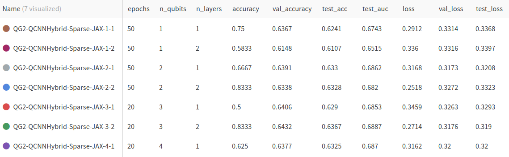
---

## Results on EP dataset with QCNN Hybrid

<p class='small-font'>380k Train | 20k val | 98k Test - 1 QConv2D Layer - 1 qubit - 1 layer</p>
<p class='small-font'>Best Test Acc: <b>0.6875</b>  |  AUC: <b>0.7415</b></p>

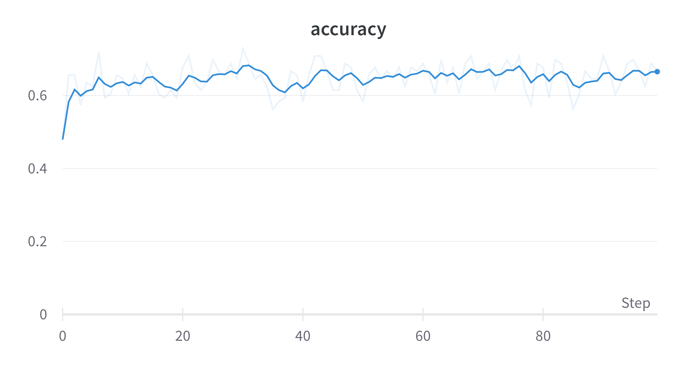
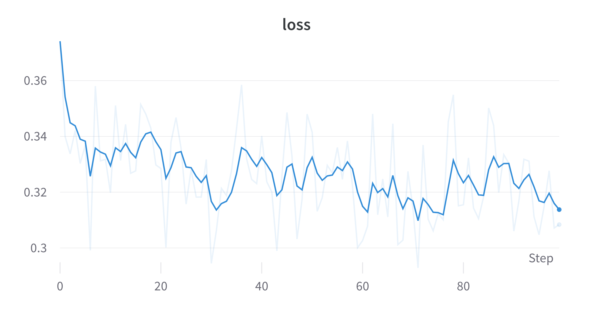
<br>
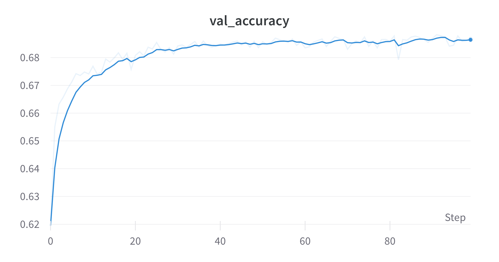


---

## Resnet Residual block like Architecture

<p class='small-font'>380k Train | 20k val | 98k Test - 1 QConv2D Layer - 1 qubit - 1 layer</p>
<p class='small-font'>Best Test Acc: <b>0.6875</b>  |  AUC: <b>0.7406</b></p>

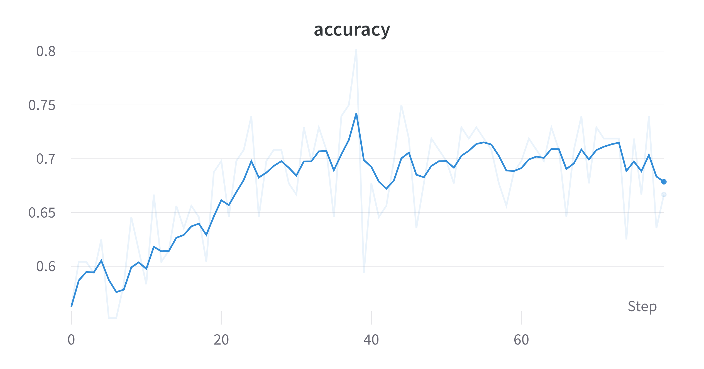
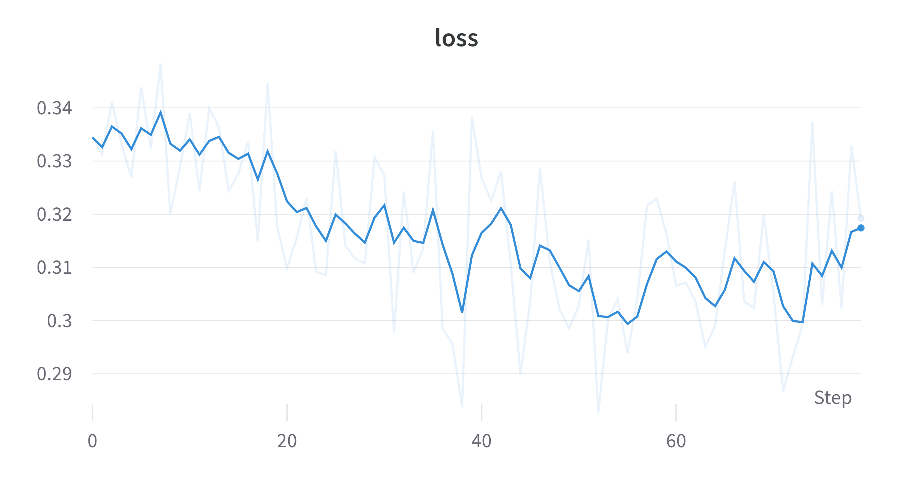
<br>
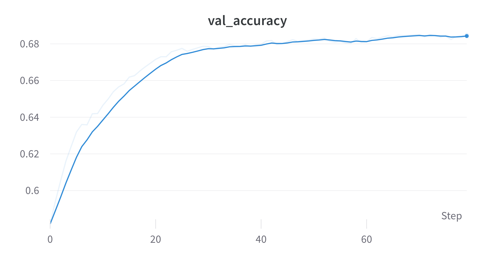
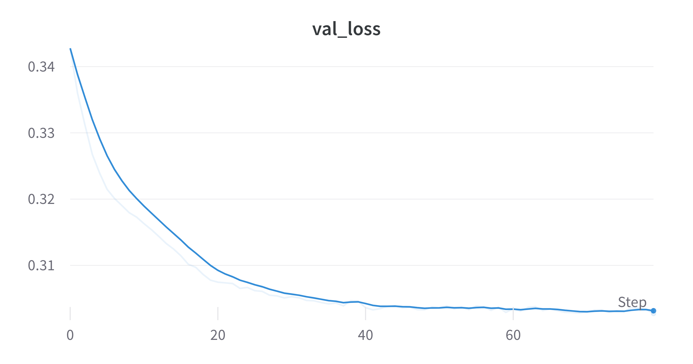

---

## Results on QG dataset with QCNN Hybrid

<p class='small-font'>665k Train | 35k val | 93.9k Test - 1 QConv2D Layer - 1 qubit - 1 layer</p>
<p class='small-font'>Test Acc: <b>0.6215</b>  |  AUC: <b>0.6666</b></p>

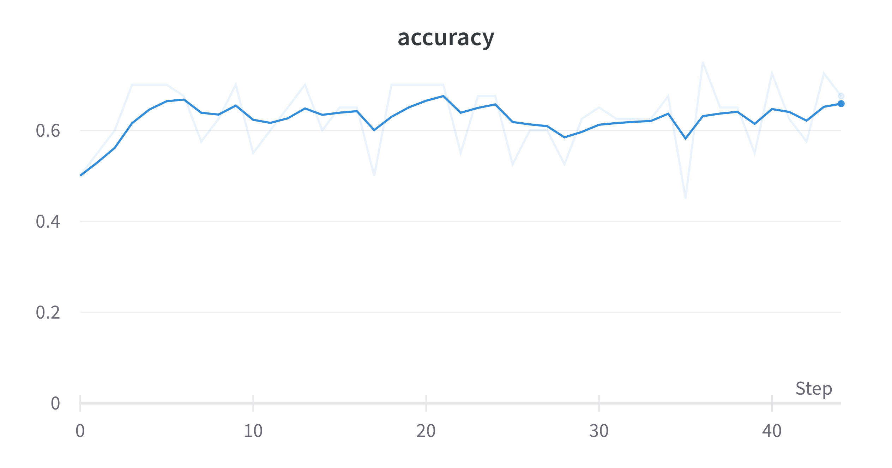
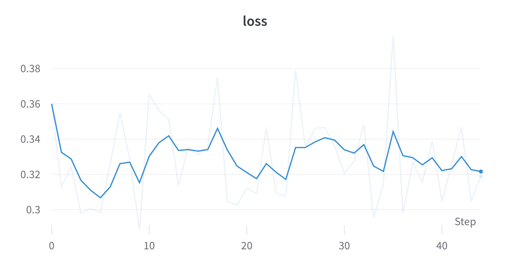
<br>
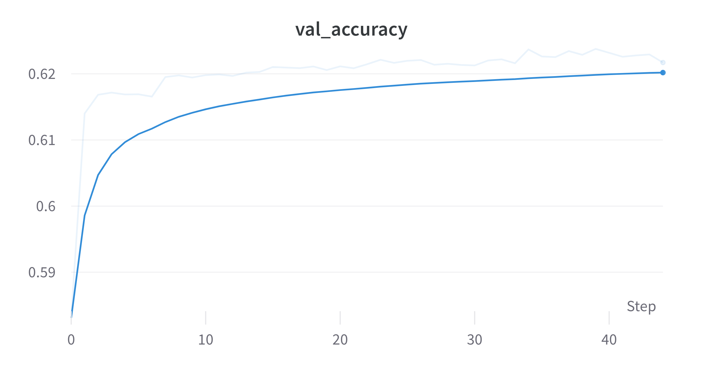
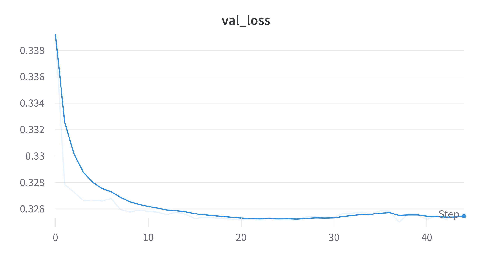

---


## Status
<div class="container">

<div class="col" >
<span style="color:#97D077"> Done: </span>

- Trained QCNNHybrid on EP and QG with JAX + Pennylane.
- Created methods to handle multiple filters for Convolution.
</div>

<div class="col">
<span style="color:#7EA6E0"> Goals for next week: </span>

- Training with more filters and QConv layers might increase AUC.
- Training fully Quantum models.
- Benchmarking classical CNNs with similar parameters.
</div>

<div class="col">
<span style="color:#F19C99"> Questions: </span>

- Feedback about Accuracy? Is it reasonable?

</div>

</div>

