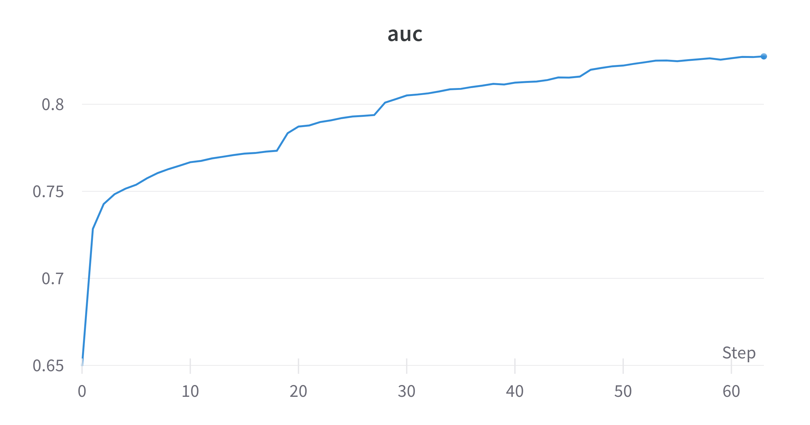
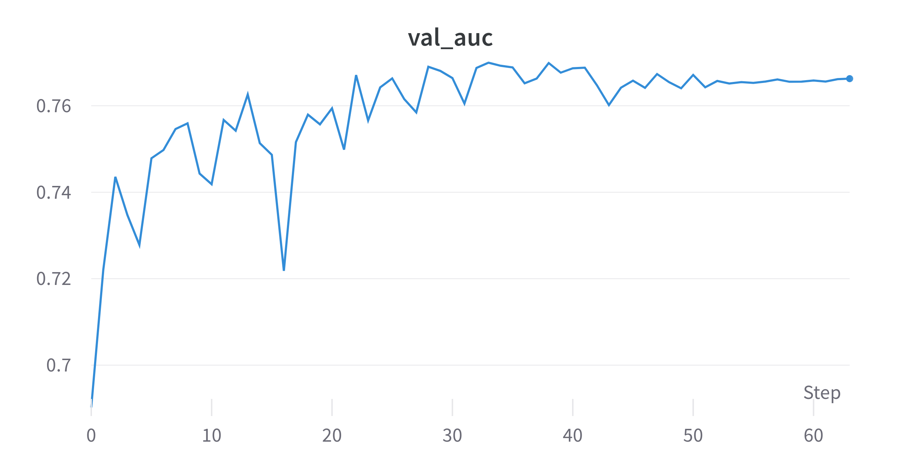
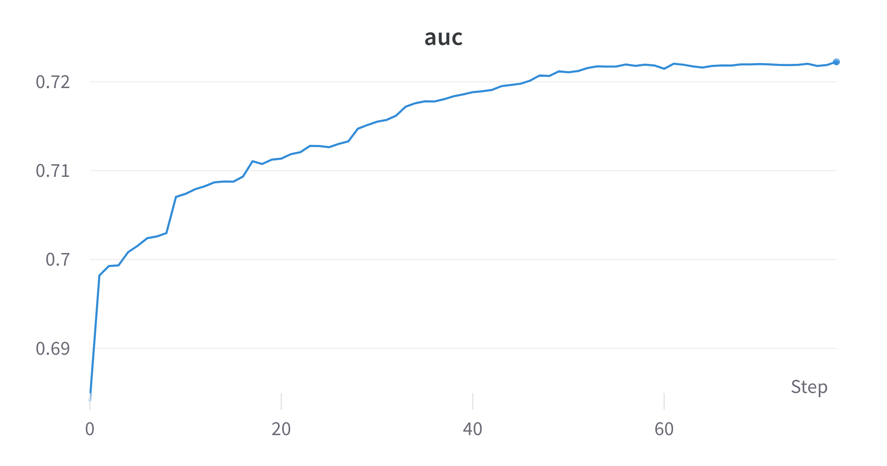
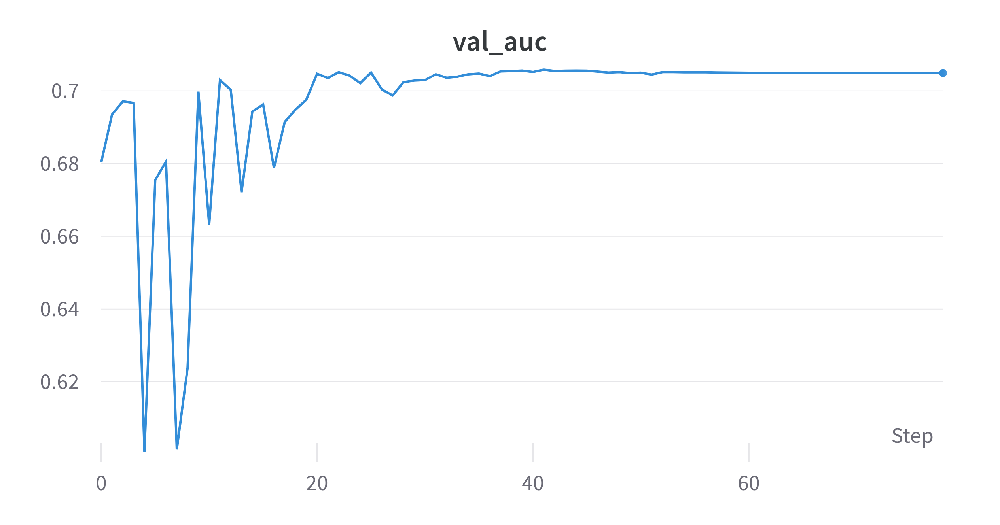

---
revealOptions:
  transition: 'fade'
  transitionSpeed: 'fast'
  width: 1400
---
<style>
.container{
    display: flex;
}
.col{
    flex: 1;
}
.small-font{
    font-size:20px;
}

.null{
    padding:0px;
    margin:0px;
}

</style>

## Some classical Results 

<p class='small-font null'><b>EP</b> Train AUC: <b>0.82</b>  |  Test AUC: <b>0.76</b></p>
<p class='small-font null'><b>QG</b> Train AUC: <b>0.72</b>  |  Test AUC: <b>0.70</b></p>



<br class='null'>




---

## Tested Two Ansatzes

```
──H──RZ(M0)──RY(M1)──RZ(M2)─┤  <Z>
```
- M0, M1, M2 holds the linear combination $b+ \sum_{i=0}^nw_ix_i$.
- 30 trainable parameters for 1 qubit 1 layer with kernel size of (3,3).

```
──H──RX(M0)──RY(M1)──RZ(M2)──RX(M3)──RY(M4)──RZ(M5)──RX(M6)──RY(M7)──RZ(M8)─┤  <Z>
```

- $M_i$ holds the linear combination $w_ix_i + b_i$.
-  18 trainable parameters for 1 qubit 1 layer with kernel size of (3,3).

- Tested on ElectronPhoton dataset with 90k train and 10k validation.

---

### Results 

Comparison with CCNN for the first ansatz.


---

### Results 

Comparison with CCNN for the second ansatz.


---


## Status
<div class="container">

<div class="col" >
<span style="color:#97D077"> Done: </span>

- Trained QCNNHybrid on EP with JAX + Pennylane with different ansatzes.
- Benchmarked the models with CCNN with approx same number of parameters.
</div>

<div class="col">
<span style="color:#7EA6E0"> Goals for next week: </span>

- Training with more filters and QConv layers might increase AUC.
- Training fully Quantum models.
</div>


</div>

