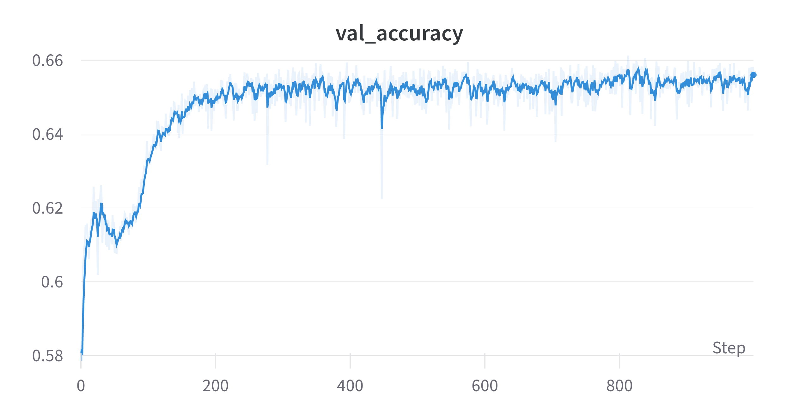
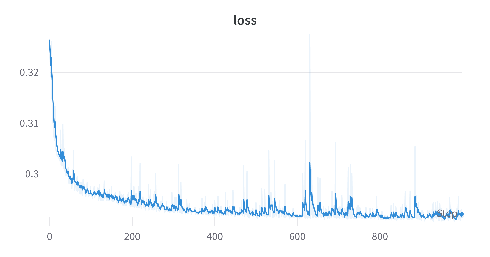

---
revealOptions:
  transition: 'fade'
  transitionSpeed: 'fast'
  width: 1400
---

## Tuned some hyperparameters

- Cropped to 10 $\times$ 10 instead of 8 $\times$ 8 for the Electron-Photon dataset.
- Used batch size of 1024 over the full dataset.
- Tried data augmentation techniques like
    - Random flip
    - Random rotation

---

## With Data augmentation

 Train AUC: <b>0.70</b>  |  Test AUC: <b>0.70</b>

 

---

## Without Data augmentation

 Train AUC: <b>0.76</b>  |  Test AUC: <b>0.759</b>

 

---

## What now?

- The data augmentation might need tuning. It has parameters like factor of rotation and fill mode.
- Testing these might give some better results.
- Decreasing the cropping might also give some better results.

---

## Status

 Done: 

- Trained QCNNHybrid on EP with JAX + Pennylane and got some good results than past ones.
- Used data augmentation techniques but they need some fine tuning.

 Goals for next week: 

- Tuning data augmentation and other hyperparams.
- Work on the classical models to improve their AUC.

